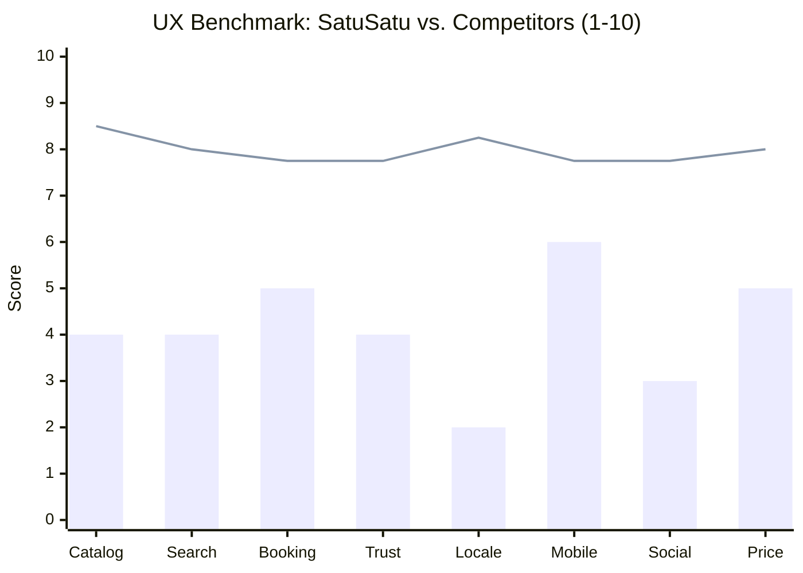
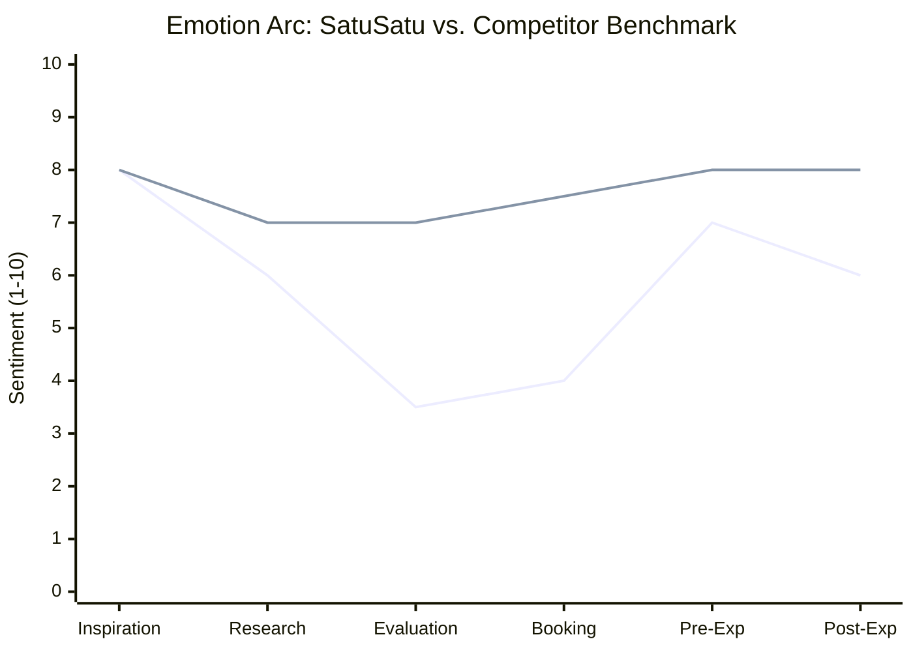

# 01 — Customer Journey Map

> **Source**: [satusatu-ux-journey-map.md](../satusatu-ux-journey-map.md) · Cross-referenced with [Product Pipeline CSV](../Satusatu%20App%20-%20Product%20Planning%20-%20Product%20Pipeline.csv)

---

## Primary Persona

| Field              | Value                                                                                     |
| ------------------ | ----------------------------------------------------------------------------------------- |
| **Name**           | Foreign Leisure Traveler                                                                  |
| **Age**            | 28–42 years                                                                               |
| **Origin Markets** | India · China · South Korea · Australia                                                   |
| **Booking Window** | 2–6 weeks before travel                                                                   |
| **Device**         | Mobile-first                                                                              |
| **Motivation**     | Book authentic Bali activities in advance from a platform they trust                      |
| **Core Anxiety**   | "Is this platform safe? Will my money be protected? Will the experience actually happen?" |

---

## Competitor UX Benchmarking — Scoring Radar

> Composite score (1–10) per criterion for the foreign visitor persona booking Bali activities. Higher = better foreign visitor experience.

| Criterion          | SatuSatu | Klook   | KKday   | GetYourGuide | Trip.com |
| ------------------ | -------- | ------- | ------- | ------------ | -------- |
| Catalog Depth      | 4        | 9       | 8       | 9            | 8        |
| Search & Filter    | 4        | 8       | 7       | 9            | 8        |
| Booking Flow       | 5        | 8       | 7       | 9            | 7        |
| Trust Signals      | 4        | 8       | 7       | 9            | 7        |
| Localization       | 2        | 8       | 8       | 8            | 9        |
| Mobile UX          | 6        | 8       | 7       | 8            | 8        |
| Social Proof       | 3        | 9       | 6       | 9            | 7        |
| Price Transparency | 5        | 8       | 7       | 9            | 8        |
| **Average**        | **4.1**  | **8.3** | **7.1** | **8.8**      | **7.8**  |

> **Takeaway**: SatuSatu averages 4.1/10 vs. the competitive mean of 8.0. The gap is widest in **Localization** (2 vs. 8.3 avg), **Social Proof** (3 vs. 7.8 avg), and **Catalog Depth** (4 vs. 8.5 avg). These are the conversion-killing gaps.

---

## Customer Journey — 6 Stages

### Emotion Arc

> Sentiment score (1–10) mapped across journey stages. The dip at Evaluation and Booking reflects SatuSatu's trust and friction gap versus global OTAs.

| Stage              | SatuSatu | Competitor Avg | Gap      |
| ------------------ | -------- | -------------- | -------- |
| 1. Inspiration     | 8.0      | 8.0            | 0.0      |
| 2. Research        | 6.0      | 7.0            | -1.0     |
| 3. Evaluation      | 3.5      | 7.0            | **-3.5** |
| 4. Booking         | 4.0      | 7.5            | **-3.5** |
| 5. Pre-Experience  | 7.0      | 8.0            | -1.0     |
| 6. Post-Experience | 6.0      | 8.0            | -2.0     |

> **Critical Valley**: Stages 3–4 (Evaluation → Booking) show a **-3.5 point gap** versus competitors. This is where foreign visitors decide SatuSatu is "not trustworthy enough" and switch to Klook or GetYourGuide. All NOW-horizon initiatives target this valley.

---

## Stage-by-Stage Journey Detail

### Stage 1 — Inspiration 💜

> *Discovering that Bali activities can be booked in advance online*

| Dimension       | Detail                                                                                        |
| --------------- | --------------------------------------------------------------------------------------------- |
| **Emotion**     | 😊 Excited · Inspired · Curious                                                                |
| **User Goal**   | Identify the best activities for their Bali trip                                              |
| **Touchpoints** | Instagram / TikTok reels · YouTube vlogs · Google Search · Reddit / forums · Friends & family |
| **Actions**     | Scrolls travel content · Saves posts · Watches "Bali travel guide" videos · Reads listicles   |
| **User Quote**  | *"Bali looks incredible — I need to book that Nusa Penida tour and the sunrise trek ASAP."*   |

**Pain Points**:
- SatuSatu has minimal presence in global travel content — rarely appears in Instagram tags, YouTube mentions, or Reddit threads vs. Klook/GYG
- No blog or editorial "Bali guide" content to capture top-of-funnel search traffic

**Opportunities**:
- Launch a Bali editorial hub ("Best Things to Do in Bali 2026") optimized for SEO & Google Discover
- Partner with Indonesian travel creators to feature SatuSatu in Bali vlogs with affiliate tracking

**Backlog Cross-Reference** (Pipeline):

| Pipeline Item                                      | Squad  | Status   | Connection                               |
| -------------------------------------------- | ------ | -------- | ---------------------------------------- |
| Blog Tracker                                 | PAYCOM | Released | Content infrastructure for editorial hub |
| Wordpress Improvements - In line product CTA | CONTEX | Released | Blog-to-booking conversion               |
| Implement llms.txt (one off)                 | PAYCOM | Released | AI/LLM discoverability                   |
| Implement llms.txt (dynamic)                 | PAYCOM | —        | AI/LLM discoverability                   |

---

### Stage 2 — Research 🔵

> *Exploring Bali activity options, reading reviews, comparing platforms*

| Dimension       | Detail                                                                                                                              |
| --------------- | ----------------------------------------------------------------------------------------------------------------------------------- |
| **Emotion**     | 😐 Methodical · 😟 Slightly overwhelmed · 😐 Analytical                                                                                |
| **User Goal**   | Build a shortlist of activities with reliable info; find the most trustworthy platform                                              |
| **Touchpoints** | Google Search (mobile) · Klook / GYG / Airbnb Experiences · TripAdvisor · Travel blogs · KakaoTalk / WeChat groups                  |
| **Actions**     | Searches "Nusa Penida day tour" · Compares Klook vs. GYG listings · Reads 10–20 reviews per activity · Checks cancellation policies |
| **User Quote**  | *"There are so many options. I'll stick to platforms I know — Klook has thousands of reviews, I trust that."*                       |

**Pain Points**:
- SatuSatu does not rank visibly in Google searches for "Bali activities" — dominated by Klook, GYG, Viator, TripAdvisor
- Foreign users will not discover SatuSatu organically without prior awareness
- Competitor platforms surface review counts (Klook: 813 activities) — SatuSatu's review density appears thin

**Opportunities**:
- Invest in destination SEO: rank for "Nusa Penida tour", "Mount Batur sunrise trek", "Bali cooking class Ubud"
- Display total booking/review counts prominently: "10,000+ experiences booked"
- Add cross-platform review import (TripAdvisor, Google) to boost visible review density

**Backlog Cross-Reference** (Pipeline):

| Pipeline Item                  | Squad  | Status | Connection                              |
| ------------------------ | ------ | ------ | --------------------------------------- |
| Destination page         | CONTEX | Design | SEO hub pages for Bali sub-destinations |
| SEO Improvements         | CONTEX | —      | Organic search infrastructure           |
| Discover Filter & Sort   | CONTEX | On Dev | Search quality for research phase       |
| One card per row results | PAYCOM | —      | Discovery layout optimization           |
| Sort by biggest discount | PAYCOM | —      | Price-conscious research support        |

---

### Stage 3 — Evaluation 🩵

> *Shortlisting SatuSatu vs. global OTAs — trust audit and platform credibility check*

| Dimension       | Detail                                                                                                                                    |
| --------------- | ----------------------------------------------------------------------------------------------------------------------------------------- |
| **Emotion**     | 😟 Skeptical · 😟 Uncertain · 😐 Cautiously open                                                                                             |
| **User Goal**   | Decide which platform is safest; verify activity quality; confirm cancellation terms                                                      |
| **Touchpoints** | SatuSatu.com · Direct comparison vs. Klook listing · Google: "SatuSatu review" / "is SatuSatu safe?" · App Store ratings                  |
| **Actions**     | Scans for trust signals · Checks review counts + reviewer nationalities · Tests search · Googles "SatuSatu legit"                         |
| **User Quote**  | *"Never heard of SatuSatu. Prices look good but I don't see many reviews from people like me. Maybe I'll just book on Klook to be safe."* |

**Pain Points**:
- Existing "Locally Curated" badge is present but not prominent enough — foreign users may not notice or understand what it means without supporting context
- Limited visible reviews from Indian/Chinese/Korean/Australian travelers — homophily bias
- Platform name "SatuSatu" is Indonesian — triggers unfamiliarity anxiety without trust scaffolding
- No aggregate social proof number on homepage (Klook shows "813 Bali activities")
- No free cancellation badge on listing cards

**Opportunities**:
- Enhance the existing "Locally Curated" badge — add tooltip explaining the vetting process, make it more prominent on listing cards, and evolve it into a tiered operator verification system
- Show review nationality flags ("✅ Reviewed by travelers from 🇮🇳🇦🇺🇰🇷")
- Homepage hero: "10,000+ experiences booked" + "Locally curated for foreign visitors"
- Add free cancellation badge to all eligible listings

**Backlog Cross-Reference** (Pipeline):

| Pipeline Item                             | Squad  | Status              | Connection                            |
| ----------------------------------- | ------ | ------------------- | ------------------------------------- |
| Social Proof in Home Page           | PAYCOM | Product Requirement | Addresses aggregate social proof gap  |
| External Review                     | CONTEX | On Dev              | Cross-platform review import          |
| Retool Rating & Total Sold (via DB) | CONTEX | On Dev              | Data infrastructure for social proof  |
| Product Detail Improvements         | CONTEX | Released            | Trust signal display on listing pages |

---

### Stage 4 — Booking 🟢

> *Completing a transaction on SatuSatu.com on mobile*

| Dimension       | Detail                                                                                                            |
| --------------- | ----------------------------------------------------------------------------------------------------------------- |
| **Emotion**     | 😐 Cautious (account) · 😊 Relieved if confirmed                                                                    |
| **User Goal**   | Complete payment quickly and confidently; receive clear confirmation                                              |
| **Touchpoints** | Listing detail page · Account creation flow · Payment gateway · Confirmation email · WhatsApp support             |
| **Actions**     | Selects date + package → Hits "Book Now" → Forced to create account → Fills details → Chooses payment → Completes |
| **User Quote**  | *"I have to create an account just to book? And I can't pay with Google Pay?"*                                    |

**Pain Points**:
- Mandatory account creation before checkout — friction barrier for one-time foreign travelers
- Limited foreign payment methods — no Google Pay, Apple Pay, Alipay, WeChat Pay, UPI, KakaoPay
- Countdown timer may increase anxiety rather than urgency for unfamiliar users
- No confirmation in user's preferred language

> **Note**: SatuSatu currently does **not** charge a platform fee or service fee. If fees are introduced in the future, they should be displayed upfront on the listing card (all-inclusive pricing) to avoid the "drip pricing" pattern that erodes trust on competitor platforms.

**Opportunities**:
- Add Google/Apple social login + guest checkout — target 15–25% checkout conversion lift
- Integrate Apple Pay, Google Pay, Alipay, WeChat Pay, UPI
- If/when fees are introduced, show all-inclusive price upfront from day one
- Offer "Pay Later" for bookings 2+ weeks ahead

**Backlog Cross-Reference** (Pipeline):

| Pipeline Item                                  | Squad  | Status        | Connection                         |
| ---------------------------------------- | ------ | ------------- | ---------------------------------- |
| SSO phase 1                              | PAYCOM | Testing       | Removes mandatory account creation |
| I8n Payment (incl. 2C2P integration)     | PAYCOM | On Dev        | Foreign payment method parity      |
| Guest Purchase + My Booking for Guest    | CONTEX | To Prioritize | Full guest checkout flow           |
| Improve UX from booking to signup        | PAYCOM | —             | Auth-to-booking friction reduction |
| Move from email pass signup to OTP based | PAYCOM | —             | Faster auth for mobile users       |
| Move Sign up/in CTA to top of page       | PAYCOM | —             | Reduce cognitive load in auth      |
| Package Options                          | CONTEX | Next Pickup   | Booking clarity improvement        |
| CS Widget                                | CONTEX | Released      | In-flow support access             |

---

### Stage 5 — Pre-Experience 🟠

> *Between booking confirmation and the activity day — logistics, questions, reassurance*

| Dimension       | Detail                                                                                                                        |
| --------------- | ----------------------------------------------------------------------------------------------------------------------------- |
| **Emotion**     | 😊 Anticipating · 😐 Slightly anxious (logistics) · 😊 Organized                                                                 |
| **User Goal**   | Receive clear logistics (meeting point, what to bring); feel confident the booking is real; be able to modify if plans change |
| **Touchpoints** | Confirmation email · SatuSatu app · WhatsApp from operator · Reminder notification · Google Maps                              |
| **Actions**     | Re-reads confirmation · Checks meeting point on Maps · Asks WhatsApp support · Shares with companions · Downloads app         |
| **User Quote**  | *"I'm excited but I'm not 100% sure where the pickup point is. The email is a bit vague."*                                    |

**Pain Points**:
- Confirmation email may not include embedded Google Maps link for unfamiliar Bali geography
- No proactive reminder push notification 24 hours before (Klook sends automated day-before reminders)
- No multilingual logistics information
- No in-app chat with operator before activity day

**Opportunities**:
- Automated pre-activity email (T-24h and T-2h) with embedded map, checklist, operator contact, weather
- Add in-app operator chat from booking detail page
- Multilingual logistics summaries (auto-translated) for Mandarin, Hindi, Korean travelers
- "Share itinerary" deep link to send booking details to companions

**Backlog Cross-Reference** (Pipeline):

| Pipeline Item                     | Squad  | Status        | Connection                               |
| --------------------------- | ------ | ------------- | ---------------------------------------- |
| WhatsApp Notifications      | CONTEX | Released      | Operator-to-traveler communication       |
| My Booking                  | CONTEX | To Prioritize | Central booking management post-purchase |
| Predefined Form for Visitor | CONTEX | Released      | Structured pre-activity data collection  |

---

### Stage 6 — Post-Experience 🔴

> *Review, repeat purchase consideration, word-of-mouth advocacy*

| Dimension       | Detail                                                                                                                                |
| --------------- | ------------------------------------------------------------------------------------------------------------------------------------- |
| **Emotion**     | 😊 Happy if activity great · 😐 Indifferent to platform brand · 😟 No incentive to return                                                |
| **User Goal**   | Share experience on social media; leave a review if great; return for future trips                                                    |
| **Touchpoints** | Review request email · App review prompt · Instagram / TikTok · WhatsApp groups · Future trip planning                                |
| **Actions**     | Posts Bali photos/reels · May or may not tag SatuSatu · Opens review email · Recommends to friends · Doesn't return (no loyalty hook) |
| **User Quote**  | *"The tour was amazing! But I'll probably just book Klook next time — I'm already logged in there and have credits."*                 |

**Pain Points**:
- No loyalty program or review reward — Klook's KlookCash directly incentivizes reviews AND repeat booking
- No post-stay email sequence (curated "you might love this next" follow-up)
- Platform brand not top-of-mind after activity — user remembers the experience, not SatuSatu
- No referral program to convert happy travelers into brand advocates
- Social content posted doesn't link back to SatuSatu — missed UGC capture

**Opportunities**:
- Launch "SatuSatu Credits" loyalty program — earn credits per booking + review; redeem on next trip
- Post-activity email: "You might love..." with AI-personalized next activities + 10% loyalty discount
- Referral program: "Share with a friend, both get IDR 50,000 credit"
- UGC campaign: incentivize tagging @satusatu on Instagram/TikTok

**Backlog Cross-Reference** (Pipeline):

| Pipeline Item                                            | Squad  | Status              | Connection                                |
| -------------------------------------------------- | ------ | ------------------- | ----------------------------------------- |
| Voucher in Home Page                               | PAYCOM | Product Requirement | Return visit incentive display            |
| Analytics in CH                                    | CONTEX | Next Pickup         | Post-experience engagement tracking       |
| Product Detail Recommended Products and Activities | CONTEX | To Prioritize       | "You might love..." recommendation engine |
| Upsell other recommended attractions               | PAYCOM | —                   | Cross-sell in post-booking flow           |

---

## Site Audit Summary — 9 UX Dimensions

> Full audit from UX Journey Map conducted March 2026. Condensed to status counts per dimension.

| UX Dimension             | ✅ Present | ⚠️ Partial | ❌ Missing | Worst Gap                                                  |
| ------------------------ | --------- | --------- | --------- | ---------------------------------------------------------- |
| Information Architecture | 2         | 1         | 2         | No destination-level hub pages                             |
| Search & Discovery       | 2         | 1         | 3         | No autocomplete, no price/duration filters                 |
| Attraction Detail Pages  | 3         | 1         | 2         | No "What's included" checklist, no recommendations         |
| Booking Flow             | 3         | 1         | 2         | No guest checkout, no "Pay Later"                          |
| Trust Signals            | 2         | 1         | 3         | No operator verification, no free-cancel badge             |
| Mobile Experience        | 2         | 1         | 2         | No QR/digital ticket optimization                          |
| Language & Localization  | 1         | 1         | 3         | No Mandarin/Hindi/Korean, no currency localization         |
| Pricing Transparency     | 2         | 1         | 2         | No "From" price on listing cards; no price-match guarantee |
| Support & Post-Booking   | 2         | 1         | 2         | No foreign-language support, no post-experience email      |
| **Totals**               | **19**    | **9**     | **21**    | —                                                          |

> **21 missing features** vs. **19 present**. The platform is roughly half-built for the foreign visitor persona. The missing features cluster in Trust, Localization, and Discovery — exactly the pillars the NOW horizon targets.

---

## The Core Strategic Problem

> SatuSatu has a genuinely differentiated value proposition — **locally curated, authentic Indonesian experiences**. But it is invisible to the foreign traveler at the top of funnel, and fails to convert the ones who do find it due to missing trust scaffolding, limited localization, and a friction-heavy booking flow. Global OTAs win not because they offer better experiences, but because they've **eliminated doubt at every step of the journey**.

### One-Line Strategic Recommendation per Competitor

| Competitor       | Strategic Stance     | Learn or Differentiate                                                                                            |
| ---------------- | -------------------- | ----------------------------------------------------------------------------------------------------------------- |
| **Klook**        | `Learn from`         | Adopt KlookCash-style loyalty credits tied to reviews; make "free cancellation" a hero badge                      |
| **KKday**        | `Differentiate from` | Out-authenticate their "local experience" pitch with verifiable operator profiles + "Only on SatuSatu" exclusives |
| **GetYourGuide** | `Learn from`         | Replicate "Certified" badge, Pay Later, auto-currency — top conversion blockers                                   |
| **Trip.com**     | `Niche target`       | Don't compete head-to-head for Chinese travelers; focus on Indian/Korean markets where Trip.com is weakest        |
