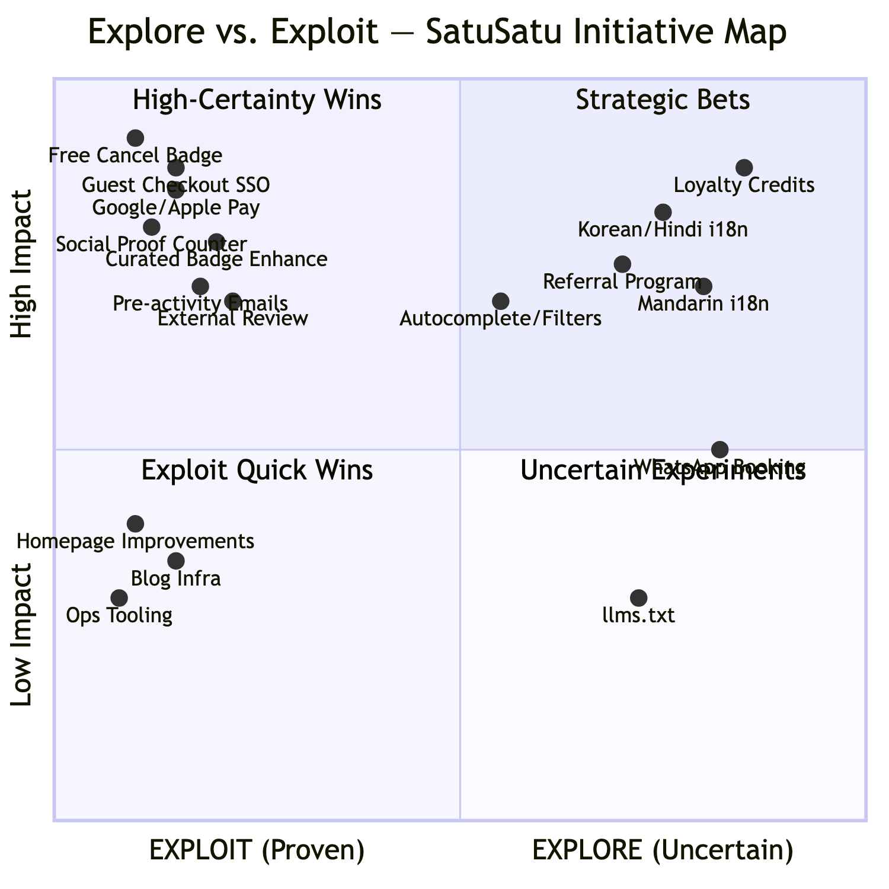
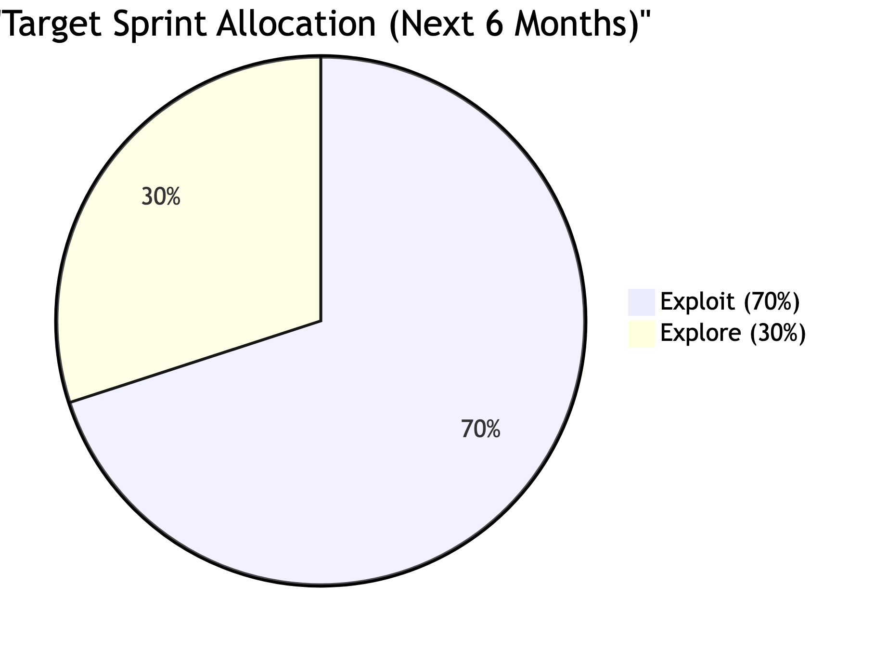
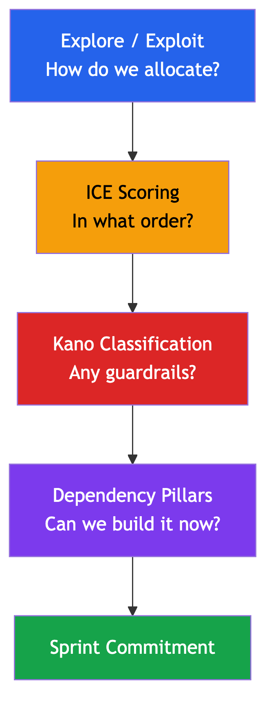

# 02 — Strategic Framing: Explore vs. Exploit

> **Sequential Thinking MCP**: Used to classify all initiatives into Explore/Exploit quadrants and reconcile cross-source conflicts.

---

## The Theory: March's (1991) Organizational Learning Model

James March's seminal model frames all organizational activity as a balance between two modes:

| Mode        | Definition                   | Characteristics                                                                    | Risk                                                                                  |
| ----------- | ---------------------------- | ---------------------------------------------------------------------------------- | ------------------------------------------------------------------------------------- |
| **Exploit** | Optimizing known territory   | Proven patterns, competitors already do it, low uncertainty, fixes existing funnel | Over-exploit → stagnation. Product becomes a "fast follower" with no differentiation. |
| **Explore** | Venturing into new territory | Uncertain ROI, building new capabilities, market expansion, unproven mechanics     | Over-explore → resource scatter. Team chases novelty before validating the base.      |

> **March's Key Warning**: Organizations systematically over-exploit at the expense of long-run adaptive fitness. But for SatuSatu — post-launch with domestic traction but **zero proven foreign visitor acquisition** — the risk runs in both directions.

### The SatuSatu Dilemma

- **Over-exploit risk**: Polishing the domestic booking flow without building foreign trust infrastructure = optimizing a product that foreigners never see
- **Over-explore risk**: Launching Korean localization, loyalty programs, and WhatsApp booking before fixing the checkout flow = pouring new users into a leaky funnel

> **The Answer**: Staged rebalancing. **Fix-to-convert now, then explore-to-grow.** A 5% improvement in checkout conversion from foreign visitors creates more GMV than a new language market with the same broken checkout flow.

---

## Explore/Exploit Quadrant — All SatuSatu Initiatives

> Every initiative from both the product roadmap and product pipeline classified by uncertainty and strategic intent.

### EXPLOIT — High Certainty (Proven Patterns)

Competitors have already validated these. Absence is a competitive liability, not a feature decision.

| Initiative                          | Source  | Squad  | Pillar     | Kano        | Status                |
| ----------------------------------- | ------- | ------ | ---------- | ----------- | --------------------- |
| Free cancellation badge on listings | Roadmap  | —      | Trust      | Basic       | NOW                   |
| Platform social proof counter       | Both     | PAYCOM | Trust      | Basic       | Product Requirement   |
| Guest checkout + Google/Apple SSO   | Both     | PAYCOM | Conversion | Basic       | Testing (SSO phase 1) |
| Google Pay + Apple Pay integration  | Roadmap  | —      | Conversion | Basic       | NOW                   |
| Locally Curated badge enhancement   | Roadmap  | —      | Trust      | Performance | NOW                   |
| Pre-activity automated emails       | Roadmap  | —      | Conversion | Performance | NOW                   |
| Review nationality display          | Roadmap  | —      | Trust      | Performance | NEXT                  |
| Product Detail Improvements         | Pipeline | CONTEX | Conversion | Performance | Released              |
| External Review                     | Pipeline | CONTEX | Trust      | Performance | On Dev                |
| CS Widget                           | Pipeline | CONTEX | Conversion | Performance | Released              |
| WhatsApp Notifications              | Pipeline | CONTEX | Conversion | Performance | Released              |
| Package Options                     | Pipeline | CONTEX | Conversion | Performance | Next Pickup           |
| My Booking                          | Pipeline | CONTEX | Conversion | Performance | To Prioritize         |

### EXPLOIT — Quick Wins (Small Effort, Known Value)

| Initiative                           | Source | Squad  | Pillar      | Status              |
| ------------------------------------ | ------ | ------ | ----------- | ------------------- |
| Home Page Curated Exp Update         | Pipeline | PAYCOM | Discovery   | Released            |
| Multiple Image Banners               | Pipeline | PAYCOM | Discovery   | Released            |
| Custom Sections                      | Pipeline | PAYCOM | Discovery   | Released            |
| Voucher in Home Page                 | Pipeline | PAYCOM | Conversion  | Product Requirement |
| Pop Up without Param                 | Pipeline | PAYCOM | Conversion  | Product Requirement |
| Move Sign up/in CTA to top           | Pipeline | PAYCOM | Conversion  | —                   |
| Move from email pass to OTP based    | Pipeline | PAYCOM | Conversion  | —                   |
| Improve UX from booking to signup    | Pipeline | PAYCOM | Conversion  | —                   |
| One card per row results             | Pipeline | PAYCOM | Discovery   | —                   |
| Sort by biggest discount             | Pipeline | PAYCOM | Discovery   | —                   |
| Standardize locale naming convention | Pipeline | PAYCOM | Infra       | On Dev              |
| Inform CS when new catalog created   | Pipeline | CONTEX | Ops         | Released            |
| Predefined Form for Visitor          | Pipeline | CONTEX | Ops         | Released            |
| Variant multi merchant               | Pipeline | CONTEX | Ops         | On Dev              |
| Retool Rating & Total Sold           | Pipeline | CONTEX | Ops         | On Dev              |
| Product Setup Improvements           | Pipeline | CONTEX | Ops         | Next Pickup         |
| Analytics in CH                      | Pipeline | CONTEX | Measurement | Next Pickup         |
| Blog Tracker                         | Pipeline | PAYCOM | Content     | Released            |
| Wordpress Improvements - In line CTA | Pipeline | CONTEX | Content     | Released            |

### EXPLORE — High Uncertainty (New Capabilities)

Unproven for SatuSatu. Uncertain ROI. Require validation before full commitment.

| Initiative                             | Source  | Squad  | Pillar       | Kano        | Status        | Risk                                                           |
| -------------------------------------- | ------- | ------ | ------------ | ----------- | ------------- | -------------------------------------------------------------- |
| I8n Translations                       | Both     | PAYCOM | Localization | Delight     | On Dev        | High effort (L), unproven conversion lift for foreign visitors |
| I8n Payment (incl. 2C2P integration)   | Pipeline | PAYCOM | Localization | Delight     | On Dev        | New payment gateway, uncertain adoption                        |
| Korean + Hindi UI localization         | Roadmap  | —      | Localization | Delight     | LATER         | Full i18n is expensive; language may not be the barrier        |
| Mandarin UI localization               | Roadmap  | —      | Localization | Delight     | LATER         | Chinese market dominated by Trip.com                           |
| Implement locale dan hreflang di blog  | Pipeline | CONTEX | Discovery    | —           | To Prioritize | i18n infra required                                            |
| Destination page                       | Pipeline | CONTEX | Discovery    | Performance | Design        | SEO effectiveness unproven                                     |
| Autocomplete + Search Filters          | Both     | CONTEX | Discovery    | Performance | On Dev        | Engineering complexity (M)                                     |
| Discover Filter & Sort                 | Pipeline | CONTEX | Discovery    | Performance | On Dev        | Same as above                                                  |

### EXPLORE — Strategic Bets (Large Investment, Potential Differentiation)

High-risk, high-reward. Only pursue once Exploit base is stable.

| Initiative                             | Source | Pillar     | Kano        | Status        | Risk                                                    |
| -------------------------------------- | ------ | ---------- | ----------- | ------------- | ------------------------------------------------------- |
| Loyalty / credits program              | Roadmap  | Retention  | Delight     | LATER         | XL effort; needs transaction volume to design correctly |
| Referral program                       | Roadmap  | Retention  | Delight     | LATER         | Uncertain LTV from referred users                       |
| WhatsApp-native booking flow           | Roadmap  | Conversion | Delight     | LATER         | Experimental channel; L effort                          |
| Implement llms.txt (one off)           | Pipeline | Discovery  | —           | Released      | Novel AI/SEO experiment                                 |
| Implement llms.txt (dynamic)           | Pipeline | Discovery  | —           | —             | Ongoing AI infrastructure                               |
| Post-experience email + review request | Roadmap  | Retention  | Performance | NEXT          | New retention mechanic                                  |
| Product Detail Recommended Products    | Pipeline | Conversion | —           | To Prioritize | Recommendation engine is new capability                 |
| Upsell other recommended attractions   | Pipeline | Conversion | —           | —             | New revenue mechanic, uncertain value                   |
| Guest Purchase + My Booking for Guest  | Pipeline | Conversion | —           | To Prioritize | XL effort; complex auth architecture                    |

---

## Explore/Exploit Quadrant Visualization

---

## Current vs. Recommended Ratio

### How We Measured

| Layer                          | Explore            | Exploit            | Ratio     | Assessment                                        |
| ------------------------------ | ------------------ | ------------------ | --------- | ------------------------------------------------- |
| Strategic Roadmap              | 10 items (58%)     | 7 items (42%)      | 58/42     | ⚠ Over-exploring at the strategic level           |
| Tactical Backlog               | 10 items (28%)     | 25 items (72%)     | 28/72     | ✅ Healthy — team instinctively builds Exploit     |
| **Combined (All Active Work)** | **20 items (36%)** | **32 items (64%)** | **36/64** | ⚠ Close to target, but explore is still above 30% |

> **Key Insight**: The tactical backlog is **naturally correcting** the strategic over-exploration in the roadmap. The team instinctively builds Exploit features (homepage, auth, booking flow, ops) while the roadmap document emphasizes Explore (localization, loyalty). This is actually good — the team should **formalize this instinct into policy**.

### Recommended Ratio (Next 6 Months)

| Allocation      | What It Means                                                                                                                                          | Examples                                                                                       |
| --------------- | ------------------------------------------------------------------------------------------------------------------------------------------------------ | ---------------------------------------------------------------------------------------------- |
| **70% Exploit** | Fix the funnel: trust signals, payment methods, search quality, auth friction. Table-stakes features where competitors have proved the pattern. | Free cancel badge, SSO, Google/Apple Pay, Locally Curated badge enhancement, pre-activity emails |
| **30% Explore** | Run **one** high-conviction new-market bet as a contained spike. Do not scatter exploration across three markets simultaneously.                       | Destination pages OR Korean/Hindi localization — not both in the same quarter                  |

### Startup Stage Ratios — Where SatuSatu Sits

| Stage                                    | Typical Ratio                 | Reasoning                                             |
| ---------------------------------------- | ----------------------------- | ----------------------------------------------------- |
| Pre-product/market fit                   | 80% Explore / 20% Exploit     | Need to find what works                               |
| **Post-launch, pre-traction** ← SatuSatu | **70% Exploit / 30% Explore** | Product exists; need to fix conversion before scaling |
| Growth stage                             | 50% Exploit / 50% Explore     | Base is proven; time to differentiate                 |
| Mature product                           | 70% Exploit / 30% Explore     | Optimize core; run incremental experiments            |

---

## How to Track Explore/Exploit Ratio

1. **Tag every backlog item** with `Explore` or `Exploit` in the backlog tracker (Page 08, add column: `Explore/Exploit`)
2. **Track trend over time**: Plot Explore % per sprint on a simple line chart. Ensure the average stays within 25–35% Explore.

---

## The Central Sequencing Principle

> **Achieve parity first, differentiate second.**
>
> Every rupiah and every sprint hour spent on localization (Later) is a sprint not spent closing the trust and conversion gaps (Now) that make any new traffic — localized or not — convert. A Korean-speaking user landing on a page with missing trust signals and no cancellation policy will bounce at the same rate as an English-speaking user.
>
> Fix the funnel leaks before opening new pipes.

### The Opportunity Cost Argument

For a **~10 engineer team**, the opportunity cost of exploration is disproportionately high:

| Scenario                            | Sprint Investment                    | Expected Impact                                                                              |
| ----------------------------------- | ------------------------------------ | -------------------------------------------------------------------------------------------- |
| Fix checkout conversion (Exploit)   | 2 sprints                            | +15–25% foreign checkout conversion → compound effect on ALL future foreign sessions         |
| Build Korean localization (Explore) | 4–5 sprints                          | Korean users arrive → hit same broken checkout flow → same low conversion → 4 sprints wasted |
| **Correct sequence**                | Fix checkout THEN build localization | Korean users arrive → hit functional checkout → convert → localization ROI is realized       |

> **The math is clear**: Exploit first, Explore second. The funnel multiplies the value of every subsequent investment.

---

## How Explore/Exploit Connects to the 4-Layer Model

Explore/Exploit is **Layer 1** of a four-layer prioritization model. It sets the strategic budget — but it doesn't answer "what do we build first?", "will users leave without this?", or "is this blocked by a dependency?" That's where Layers 2–4 come in.

| Layer | What It Does | Without It |
|---|---|---|
| **Explore/Exploit** | Sets the 70/30 budget split | Team either stagnates (100% Exploit) or scatters (too much Explore) |
| **ICE** | Ranks initiatives within each bucket by score | Everything feels equally important; PM picks by gut |
| **Kano** | Overrides ICE when a Basic feature scores low | "Boring" must-haves get deprioritized vs. "exciting" nice-to-haves |
| **Dependency Pillars** | Checks if prerequisites exist before committing | Team starts items blocked by unshipped dependencies |

> **Read next**: [Page 03 — Prioritization Framework](./03-prioritization-framework.md) for ICE+Kano, then [Page 04 — Dependency Graph](./04-dependency-graph.md) for sequencing.
