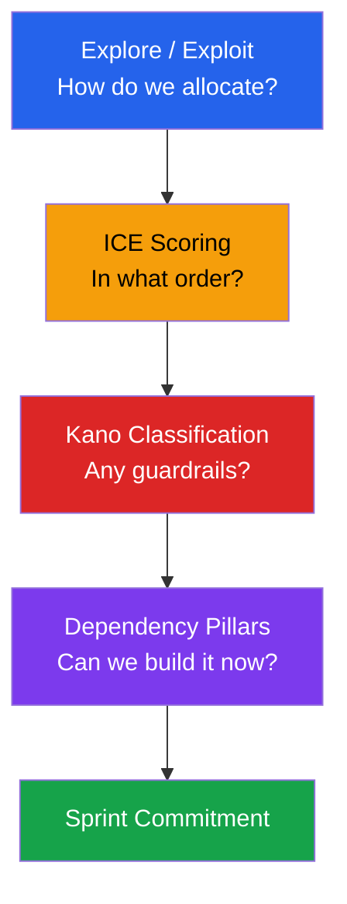
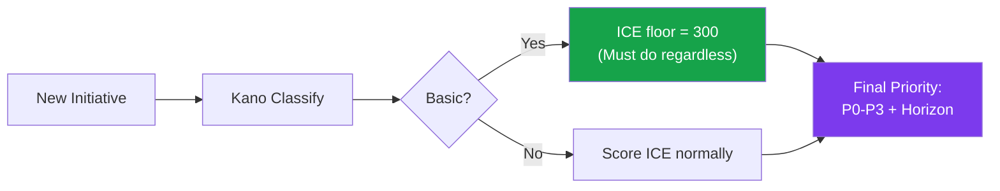
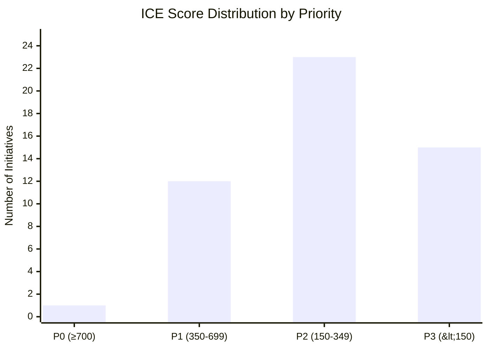

# 03 — Prioritization Framework: ICE + Kano

---

## Why ICE + Kano

### Framework Selection

| Framework            | Strengths                                                               | Weaknesses                                                           | Fit for SatuSatu                                                    |
| -------------------- | ----------------------------------------------------------------------- | -------------------------------------------------------------------- | ------------------------------------------------------------------- |
| **RICE**             | Adds Reach to Impact                                                    | Reach data rarely available at pre-traction stage                    | ❌ SatuSatu lacks traffic volume data for reliable Reach estimates   |
| **WSJF**             | SAFe-native, Cost of Delay built in                                     | Requires mature agile org; complex for small team                    | ❌ Team is ~10 engineers, not running SAFe                           |
| **MoSCoW**           | Simple, intuitive                                                       | No numeric comparison; prone to "everything is Must-Have"            | ❌ Lacks discrimination for 50+ backlog items                        |
| **Value vs. Effort** | Visual, fast                                                            | Binary axes lose nuance; no confidence dimension                     | ⚠ Useful for quick triage but insufficient for final prioritization |
| **ICE + Kano**       | Numeric scoring, confidence-calibrated, captures user expectation layer | Requires scoring discipline; can feel subjective without calibration | ✅ Right complexity for a ~10 person team with 50+ initiatives       |

### Why Four Layers

Each layer answers a **different question** at a **different altitude**. Removing any one creates a blind spot:

| Layer                         | Question It Answers                                                       | Altitude                     | What Breaks Without It                                                                                                                                      |
| ----------------------------- | ------------------------------------------------------------------------- | ---------------------------- | ----------------------------------------------------------------------------------------------------------------------------------------------------------- |
| **Explore/Exploit** (Page 02) | *"How should we allocate sprints between certainty and experimentation?"* | Strategic (quarterly)        | Team either over-exploits (stagnates) or over-explores (burns cash without fixing basics)                                                                   |
| **ICE** (this page)           | *"Within each allocation, what do we build FIRST?"*                       | Tactical (sprint)            | No ranking — everything feels equally important, PM picks by gut                                                                                            |
| **Kano** (this page)          | *"Is this something users EXPECT or something that SURPRISES them?"*      | User-expectation (guardrail) | A "boring" Basic feature with moderate ICE gets deprioritized vs. an "exciting" Performance feature — even though the Basic's absence causes users to leave |
| **Dependencies** (Page 04)    | *"Can we actually build this now, or is it blocked?"*                     | Sequencing (sprint)          | Team starts items whose prerequisites haven't shipped yet                                                                                                   |

**Why Kano can't be replaced by Explore/Exploit alone:**

Explore/Exploit tells you *where uncertainty lies* — Exploit items are proven patterns, Explore items are bets. But within the Exploit bucket, there's a critical distinction:

- **Exploit + Basic** = must-have, users leave if missing (e.g., guest checkout)
- **Exploit + Performance** = nice improvement, users are fine without it (e.g., pre-activity emails)

ICE tries to capture this via the Impact score, but PMs can underrate a "boring" Basic feature. Kano's **ICE Floor Rule** (Basic = minimum P1, ICE ≥ 300) acts as a safety net against mis-scoring.

> **Real example**: Google Pay/Apple Pay scores ICE = 256 (raw), which places it mid-P2. But it's Kano = Basic — foreign visitors without bank transfer access will abandon. The Kano floor keeps it in P1 consideration, which is the correct priority.

### The ICE + Kano Combination

**ICE** provides a numeric score (max 1,000) for rank-ordering.
**Kano** adds a qualitative classification that answers: *Even if the ICE score is the same, how will users react to its presence or absence?*

---

## ICE Scoring Methodology

### Dimensions

| Dimension          | Question                                                 | Scale | Calibration Guide                                                                                                                       |
| ------------------ | -------------------------------------------------------- | ----- | --------------------------------------------------------------------------------------------------------------------------------------- |
| **Impact (I)**     | How much does this move Weekly Qualified Bookings (NSM)? | 1–10  | 10 = directly unblocks bookings (e.g., payment method). 5 = improves funnel health. 1 = no measurable booking effect.                   |
| **Confidence (C)** | How certain are we this will work?                       | 1–10  | 10 = competitor proves it + we have data. 7 = competitors do it but no SatuSatu data. 4 = logical inference only. 1 = pure speculation. |
| **Ease (E)**       | How easy is this to implement?                           | 1–10  | 10 = XS (< 1 day). 8 = S (1 week). 6 = M (2–3 weeks). 4 = L (4–6 weeks). 2 = XL (6+ weeks).                                             |

**ICE Score = I × C × E** (max 1,000)

### Effort-to-Ease Conversion

| Effort Size | Duration  | Ease Score |
| ----------- | --------- | ---------- |
| XS          | < 1 day   | 10         |
| S           | ~1 week   | 8          |
| M           | 2–3 weeks | 6          |
| L           | 4–6 weeks | 4          |
| XL          | 6+ weeks  | 2          |

### Priority Assignment

| Priority | ICE Range | Rule                                                                 | Action                                           |
| -------- | --------- | -------------------------------------------------------------------- | ------------------------------------------------ |
| **P0**   | ≥ 700     | Critical & Urgent — table-stakes gap causing measurable revenue loss | Do immediately. No sprint delay.                 |
| **P1**   | 350–699   | Must Have — high-certainty improvements to conversion or trust       | Schedule in next 1–2 sprints.                    |
| **P2**   | 150–349   | Could Have — valuable but lower certainty or higher effort           | Backlog for NEXT horizon. Revisit quarterly.     |
| **P3**   | < 150     | Nice to Have — speculative, low-impact, or high-effort exploratory   | LATER horizon. Requires spike before committing. |

---

## Kano Classification Guide

### Definitions

| Kano Type       | User Reaction if Present   | User Reaction if Absent         | SatuSatu Example                                      |
| --------------- | -------------------------- | ------------------------------- | ----------------------------------------------------- |
| **Basic**       | No reaction — expected     | Angry, leaves platform          | Free cancellation badge, upfront pricing, SSO         |
| **Performance** | Satisfied — more is better | Mildly disappointed             | Review count, search quality, pre-activity emails     |
| **Delight**     | Wow — unexpected value     | No reaction — never expected it | Loyalty credits, WhatsApp booking, AI recommendations |

### ICE Floor Rules by Kano Type

| Kano Type       | ICE Floor             | Rationale                                                                           |
| --------------- | --------------------- | ----------------------------------------------------------------------------------- |
| **Basic**       | 300 (auto-P1 minimum) | If competitors have it and we don't, users leave. Score is irrelevant — must build. |
| **Performance** | None — score normally | More is better, but absence doesn't kill. Rank by ICE.                              |
| **Delight**     | None — score normally | Only pursue when Basic + Performance gaps are closed.                               |

> **Rule: Never ship a Delight feature while any Basic feature is missing.** Loyalty credits mean nothing if users can't checkout as a guest.

---

## Scoring Session Guide

### 5-Step Process

1. **Read the initiative brief** — What problem does it solve? What user journey stage does it address? (Reference Page 01)
2. **Classify Kano type** — Is this Basic (table-stakes), Performance (incremental), or Delight (surprise)?
3. **Score Impact** — How many NSM points (Weekly Qualified Bookings) does this plausibly move? Use the calibration guide above.
4. **Score Confidence** — What evidence supports the Impact estimate? Competitor validation = high. Gut feel = low.
5. **Score Ease** — Use the Effort-to-Ease table. Factor in dependencies (Page 04).

### Worked Example: Guest Checkout + Google/Apple SSO

| Step           | Reasoning                                                                                                         | Score |
| -------------- | ----------------------------------------------------------------------------------------------------------------- | ----- |
| **Kano**       | Klook, GYG, KKday all offer guest checkout. Foreign one-time travelers expect it. **Basic.**                      | —     |
| **Impact**     | Mandatory registration is the #1 documented checkout abandoner for foreign one-time visitors. Direct NSM blocker. | **9** |
| **Confidence** | Every OTA competitor has validated this. UX research identifies it as a pain point.                               | **9** |
| **Ease**       | SSO Phase 1 is in testing (Pipeline). Full guest checkout requires auth architecture changes. Effort = L.               | **5** |
| **ICE Score**  | 9 × 9 × 5 = **405**                                                                                               | P1    |

> SSO Phase 1 is already in testing — but the full guest purchase flow (including My Booking for Guest) requires additional effort. The high I × C scores justify P1 despite moderate Ease.

---

## Complete Scoring Table

> All initiatives from the product roadmap and product pipeline. Released items are scored for completeness but marked as shipped.

### P0 — Critical & Urgent (ICE ≥ 700)

| #   | Initiative                          | I   | C   | E   | ICE     | Kano  | Explore/Exploit | Horizon | Squad | Status |
| --- | ----------------------------------- | --- | --- | --- | ------- | ----- | --------------- | ------- | ----- | ------ |
| 1   | Free cancellation badge on listings | 9   | 9   | 9   | **729** | Basic | Exploit         | NOW     | —     | —      |

### P1 — Must Have (ICE 350–699)

| #   | Initiative                           | I   | C   | E   | ICE     | Kano  | Explore/Exploit | Horizon | Squad  | Status      |
| --- | ------------------------------------ | --- | --- | --- | ------- | ----- | --------------- | ------- | ------ | ----------- |
| 2   | Product Detail Improvements          | 7   | 8   | 10  | **560** | Perf  | Exploit         | —       | CONTEX | ✅ Released  |
| 3   | CS Widget                            | 6   | 8   | 10  | **480** | Perf  | Exploit         | —       | CONTEX | ✅ Released  |
| 4   | WhatsApp Notifications               | 6   | 8   | 10  | **480** | Perf  | Exploit         | —       | CONTEX | ✅ Released  |
| 5   | Platform social proof counter        | 8   | 8   | 7   | **448** | Basic | Exploit         | NOW     | PAYCOM | Product Req |
| 6   | Guest Checkout + SSO                 | 9   | 9   | 5   | **405** | Basic | Exploit         | NOW     | PAYCOM | Testing     |
| 7   | Home Page Curated Exp Update         | 5   | 8   | 10  | **400** | Perf  | Exploit         | —       | PAYCOM | ✅ Released  |
| 8   | Locally Curated Badge Enhancement    | 7   | 7   | 8   | **392** | Perf  | Exploit         | NOW     | —      | —           |
| 9   | Pre-activity automated emails        | 7   | 8   | 7   | **392** | Perf  | Exploit         | NOW     | —      | —           |
| 10  | Move Sign up/in CTA to top           | 6   | 7   | 9   | **378** | Perf  | Exploit         | NOW     | PAYCOM | —           |
| 11  | Custom Sections                      | 5   | 7   | 10  | **350** | Perf  | Exploit         | —       | PAYCOM | ✅ Released  |
| 12  | Predefined Form for Visitor          | 5   | 7   | 10  | **350** | Perf  | Exploit         | —       | CONTEX | ✅ Released  |
| 13  | Wordpress Improvements - In line CTA | 5   | 7   | 10  | **350** | Perf  | Exploit         | —       | CONTEX | ✅ Released  |

### P2 — Could Have (ICE 150–349)

| #   | Initiative                             | I   | C   | E   | ICE     | Kano    | Explore/Exploit | Horizon | Squad  | Status        |
| --- | -------------------------------------- | --- | --- | --- | ------- | ------- | --------------- | ------- | ------ | ------------- |
| 14  | Review nationality display             | 6   | 7   | 8   | **336** | Perf    | Exploit         | NEXT    | —      | —             |
| 15  | Package Options                        | 7   | 7   | 6   | **294** | Perf    | Exploit         | NEXT    | CONTEX | Next Pickup   |
| 16  | Move from email pass to OTP based      | 7   | 7   | 6   | **294** | Perf    | Exploit         | NEXT    | PAYCOM | —             |
| 17  | Improve UX from booking to signup      | 7   | 7   | 6   | **294** | Perf    | Exploit         | NEXT    | PAYCOM | —             |
| 18  | Multiple Image Banners                 | 4   | 7   | 10  | **280** | Perf    | Exploit         | —       | PAYCOM | ✅ Released    |
| 19  | External Review                        | 8   | 7   | 5   | **280** | Perf    | Exploit         | NEXT    | CONTEX | On Dev        |
| 20  | Blog Tracker                           | 4   | 7   | 10  | **280** | Perf    | Exploit         | —       | PAYCOM | ✅ Released    |
| 21  | Google Pay + Apple Pay integration     | 8   | 8   | 4   | **256** | Basic   | Exploit         | NOW     | —      | —             |
| 22  | Voucher in Home Page                   | 6   | 6   | 7   | **252** | Perf    | Exploit         | NEXT    | PAYCOM | Product Req   |
| 23  | Post-Experience Email + Review Request | 6   | 6   | 7   | **252** | Perf    | Explore         | NEXT    | —      | —             |
| 24  | My Booking                             | 7   | 7   | 5   | **245** | Perf    | Exploit         | NEXT    | CONTEX | To Prioritize |
| 25  | Inform CS when new catalog created     | 3   | 8   | 10  | **240** | Perf    | Exploit         | —       | CONTEX | ✅ Released    |
| 26  | Analytics in CH                        | 5   | 7   | 6   | **210** | Perf    | Exploit         | NEXT    | CONTEX | Next Pickup   |
| 27  | Autocomplete + Search Filters          | 7   | 6   | 5   | **210** | Perf    | Explore         | NEXT    | CONTEX | On Dev        |

| 28  | Discover Filter & Sort                 | 6   | 6   | 5   | **180** | Perf    | Explore         | NEXT    | CONTEX | On Dev        |
| 29  | Retool Rating & Total Sold             | 5   | 7   | 5   | **175** | Perf    | Exploit         | NEXT    | CONTEX | On Dev        |
| 30  | Destination page                       | 7   | 5   | 5   | **175** | Perf    | Explore         | NEXT    | CONTEX | Design        |
| 31  | Pop Up without Param                   | 4   | 5   | 8   | **160** | Perf    | Exploit         | NEXT    | PAYCOM | Product Req   |
| 32  | One card per row results               | 4   | 5   | 8   | **160** | Perf    | Exploit         | NEXT    | PAYCOM | —             |
| 33  | I8n Payment (incl. 2C2P integration)   | 8   | 5   | 4   | **160** | Delight | Explore         | NEXT    | PAYCOM | On Dev        |

| 34  | Implement llms.txt (one off)           | 3   | 5   | 10  | **150** | —       | Explore         | —       | PAYCOM | ✅ Released    |

### P3 — Nice to Have (ICE < 150)

| #   | Initiative                            | I   | C   | E   | ICE     | Kano    | Explore/Exploit | Horizon | Squad  | Status        |
| --- | ------------------------------------- | --- | --- | --- | ------- | ------- | --------------- | ------- | ------ | ------------- |
| 35  | Guest Purchase + My Booking for Guest | 8   | 6   | 3   | **144** | Perf    | Explore         | LATER   | CONTEX | To Prioritize |
| 36  | Standardize locale naming convention  | 3   | 8   | 6   | **144** | —       | Exploit         | NOW     | PAYCOM | On Dev        |
| 37  | Product Setup Improvements            | 4   | 6   | 6   | **144** | Perf    | Exploit         | NEXT    | CONTEX | Next Pickup   |
| 38  | Implement locale dan hreflang di blog | 5   | 5   | 5   | **125** | —       | Explore         | NEXT    | CONTEX | To Prioritize |
| 39  | Variant multi merchant                | 4   | 6   | 5   | **120** | Perf    | Exploit         | NEXT    | CONTEX | On Dev        |
| 40  | Product Detail Recommended Products   | 6   | 5   | 4   | **120** | Perf    | Explore         | LATER   | CONTEX | To Prioritize |
| 41  | I8n Translations                      | 7   | 4   | 4   | **112** | Delight | Explore         | NEXT    | PAYCOM | On Dev        |
| 42  | Upsell other recommended attractions  | 5   | 4   | 5   | **100** | Perf    | Explore         | LATER   | PAYCOM | —             |
| 43  | Referral program                      | 6   | 4   | 4   | **96**  | Delight | Explore         | LATER   | —      | —             |
| 44  | Implement llms.txt (dynamic)          | 4   | 4   | 5   | **80**  | —       | Explore         | LATER   | PAYCOM | —             |
| 45  | Sort by biggest discount              | 4   | 5   | 8   | **160** | Perf    | Exploit         | NEXT    | PAYCOM | —             |
| 46  | Korean + Hindi UI localization        | 6   | 3   | 3   | **54**  | Delight | Explore         | LATER   | —      | —             |
| 47  | WhatsApp-native booking flow          | 5   | 3   | 3   | **45**  | Delight | Explore         | LATER   | —      | —             |
| 48  | Loyalty / credits program             | 7   | 3   | 2   | **42**  | Delight | Explore         | LATER   | —      | —             |
| 49  | Mandarin UI localization              | 5   | 2   | 3   | **30**  | Delight | Explore         | LATER   | —      | —             |

---

## ICE Score Distribution

> **Key Insight**: Only **1 initiative** reaches P0 (Free cancellation badge). The P1 tier is dominated by released items (7 of 12) — the team has instinctively built high-ICE items. The remaining **5 unshipped P1 items** should be the immediate sprint focus: Social proof counter, Guest checkout SSO, Locally Curated badge enhancement, Pre-activity emails, Move CTA to top.

---

## Priority-Kano Cross-Reference

|        | Basic | Performance | Delight | Unclassified |
| ------ | ----- | ----------- | ------- | ------------ |
| **P0** | 1     | —           | —       | —            |
| **P1** | 2     | 11          | —       | —            |
| **P2** | 1     | 18          | 2       | 2            |
| **P3** | —     | 6           | 5       | 4            |

> **Validation**: All Basic items are P1 or higher (ICE floor rule enforced). Delight items appear only in P2–P3. This confirms the framework is working — it naturally sequences "fix the basics" before "delight the user."

---

## How to Score New Initiatives

When a new initiative is proposed:

1. **Open Page 08** (Backlog Tracker) and add a new row
2. **Map to journey stage** using Page 01 — which stage does this address?
3. **Tag Explore/Exploit** using the Page 02 classification approach
4. **Classify Kano** — Is this Basic (all competitors have it), Performance (more is better), or Delight (unexpected)?
5. **Score ICE** using the calibration table above. If Basic, apply ICE floor = 300.
6. **Assign Priority** (P0–P3) and **Horizon** (NOW/NEXT/LATER) from the score
7. **Check dependencies** in Page 04 before scheduling — high-ICE items blocked by dependencies should note the blocker
