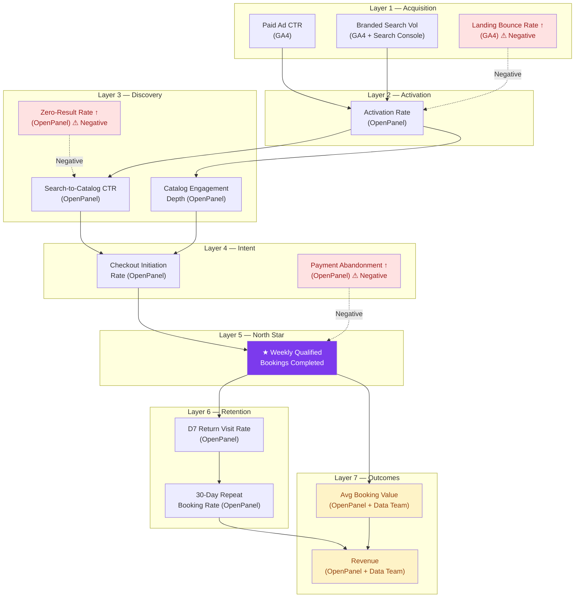

# 05 — North Star & Success Metrics

---

## Ad Platform Context

| Platform | Role | Investment Level | Primary Use |
|---|---|---|---|
| **Google Ads + GA4** | High-intent conversion — search, PMAX | Heavy investment | Drives bookings directly. GA4 is the primary analytics layer for acquisition, conversion tracking, and ROAS. |
| **Meta Ads + Meta Pixel** | Awareness — interest-based targeting | Light investment | Brand awareness and retargeting. Meta Pixel tracks view-through attribution but is not the primary conversion driver. |
| **OpenPanel** | Product analytics — in-app behavior | Core product tool | Funnel analysis, retention cohorts, feature usage. Product team's primary lens. |

> **Implication for metrics**: GA4 is the primary source for all paid acquisition and conversion metrics. Meta Pixel provides supplementary awareness attribution but should not be weighted equally with GA4 in ROAS calculations.

---

## North Star Metric

### ★ Weekly Qualified Bookings Completed

> `COUNT(booking_id WHERE status='confirmed' AND NOT cancelled_within_24h=true)` — rolling 7-day window

| Property           | Detail                                                                                                                                                                                                                                       |
| ------------------ | -------------------------------------------------------------------------------------------------------------------------------------------------------------------------------------------------------------------------------------------- |
| **Definition**     | Unique confirmed bookings in any rolling 7-day window where payment is confirmed AND booking has not been cancelled within 24 hours                                                                                                          |
| **Tools**          | `OpenPanel` (primary) · `GA4` (Google Ads conversion tracking) · `Meta Pixel` (awareness attribution, secondary)                                                                                                                             |
| **Cadence**        | Daily monitoring · Weekly review in PM ritual                                                                                                                                                                                                |
| **Why This Works** | Captures core value exchange (customer commits to experience), product-actionable (checkout, trust, payment all move it), resistant to gaming (real payment + 24h filter), volume-compound (rewards both CVR (conversion rate) improvement and traffic growth) |

### Why "Weekly Qualified Bookings"?

**Industry precedent**: Transaction-count metrics are the standard NSM for marketplace and OTA businesses at the growth stage:

| Company | Stage When Adopted | North Star Metric | Cadence |
|---|---|---|---|
| **Airbnb** | Post-launch, pre-IPO | Nights Booked | Weekly |
| **Booking.com** | Growth | Room Nights | Weekly |
| **Klook** | Series C+ | Bookings Completed | Weekly |
| **GetYourGuide** | Growth | Activities Booked | Weekly |

**Why "Weekly" cadence — not daily or monthly?**

| Cadence | Problem for SatuSatu |
|---|---|
| **Daily** | Too noisy at current volume. A single large group booking or a public holiday skews the number. Weekly smooths variance. |
| **Monthly** | Too slow for sprint feedback. A 2-week sprint ships features mid-month — monthly cadence means waiting 2–4 weeks to see impact. |
| **Weekly** | Matches sprint rhythm (1–2 week sprints). Fast enough to detect regressions, smooth enough to filter daily noise. |

**Why "Qualified" — not just "Bookings"?**

| Design Choice | Rationale |
|---|---|
| **Payment confirmed** | Excludes pending/failed payments. Only real revenue-generating events count. |
| **24h cancel filter** | Filters accidental bookings, test transactions, and immediate buyer's remorse. Without this filter, the metric is inflatable by promo-driven impulse bookings that cancel the same day. |
| **Count, not revenue** | Revenue (GMV) is affected by pricing changes, discounting, and product mix — none of which reflect product quality. Count is a purer signal of product-market fit. |

> **Benchmark target**: For a post-launch OTA with ~50 listings and paid acquisition, industry benchmarks suggest 2.5–4.5% end-to-end visit-to-booking conversion rate. At current estimated traffic, this translates to a near-term weekly booking target that the team should calibrate once OpenPanel instrumentation is live.

### Counter-Metrics

Track alongside NSM to prevent hollow growth. Each counter-metric is already captured in the Must-Have framework below — this table defines **alert thresholds** that trigger investigation:

| Counter-Metric | Guards Against | Alert Threshold | See Metric # |
|---|---|---|---|
| **Booking Cancellation Rate (48h)** | NSM rises but cancellations spike → growth is hollow | > 15% | #12 |
| **Average Booking Value (ABV)** | NSM grows via heavy discounting → revenue quality falls | ABV drops > 15% MoM | #13 |
| **D7 Return Visit Rate** | NSM grows but users don't return → no product retention | < 10% | #6 |
| **Organic Branded Search Vol** | Growth is purely from paid budget increases, not product | Declining while NSM grows | #14 |

> **Note on cancellation windows**: The NSM uses a **24-hour** cancel filter (to exclude immediate buyer’s remorse from the booking count). The counter-metric uses a **48-hour** window (to catch delayed cancellations that indicate deeper trust or quality issues). These are intentionally different thresholds.

### Rejected NSM Candidates

| Candidate               | Why Rejected                                                                  |
| ----------------------- | ----------------------------------------------------------------------------- |
| Revenue (GMV)           | Lagging indicator, gameable via discounting, owned by finance not product     |
| Booking Conversion Rate | Ratio, not count — can improve while total bookings fall                      |
| DAU/MAU                 | Engagement without value exchange — a daily browser ≠ a booker                |
| Monthly Active Bookers  | Monthly cadence too slow for weekly sprint feedback loops                     |
| Session Count           | Marketing input, not product outcome — product doesn't control SEO/ad budgets |

---

## Metrics Framework

### Must-Have Metrics (14)

> Non-negotiable — product cannot make informed decisions without these.

#### Leading Indicators (8)

| #   | Metric                          | Signal Area | Definition                                                                  | Tool                | Cadence |
| --- | ------------------------------- | ----------- | --------------------------------------------------------------------------- | ------------------- | ------- |
| 1   | **Checkout Initiation Rate**    | Conversion  | % of listing-view sessions where user clicks Book Now → checkout step 1     | `OpenPanel`         | Daily   |
| 2   | **Payment Abandonment Rate**    | Conversion  | % of checkout_initiated NOT followed by booking_completed within 30 min     | `OpenPanel`         | Daily   |
| 3   | **Search-to-Catalog CTR**       | Discovery   | % of search queries resulting in ≥1 listing detail page click               | `OpenPanel`         | Daily   |
| 4   | **Catalog Engagement Depth**    | Discovery   | Average unique listing detail pages viewed per session                      | `OpenPanel`         | Weekly  |
| 5   | **Activation Rate**             | Activation  | % of new users (session 1) who view ≥2 listings AND fire checkout_initiated | `OpenPanel`         | Weekly  |
| 6   | **D7 Return Visit Rate**        | Retention   | % of new users who return within 7 days of first visit                      | `OpenPanel`         | Weekly  |
| 7   | **Search Zero-Result Rate**     | Discovery   | % of search queries returning 0 results                                     | `OpenPanel` + `GA4` | Daily   |
| 8   | **Paid Ad Landing Bounce Rate** | Acquisition | % of Google Ads paid traffic sessions that exit without viewing any listing | `GA4`               | Daily   |

#### Lagging Indicators (6)

| #   | Metric                          | Signal Area | Definition                                                   | Tool                | Cadence |
| --- | ------------------------------- | ----------- | ------------------------------------------------------------ | ------------------- | ------- |
| 9   | **★ Weekly Qualified Bookings** | Conversion  | NSM — confirmed bookings, 24h cancel filter, 7-day rolling   | `OpenPanel` + `GA4` | Weekly  |
| 10  | **Booking Conversion Rate**     | Conversion  | (Qualified bookings ÷ unique sessions) × 100, 30-day rolling | `GA4` + `OpenPanel` | Weekly  |
| 11  | **30-Day Repeat Booking Rate**  | Retention   | % of users with ≥2 confirmed bookings within 30 days         | `OpenPanel`         | Monthly |
| 12  | **Booking Cancellation Rate**   | Conversion  | % of confirmed bookings cancelled within 48h                 | `OpenPanel` + Backend | Weekly  |
| 13  | **Average Booking Value**       | Conversion  | Mean IDR value per confirmed transaction, 30-day rolling     | `OpenPanel` + Data Team | Weekly  |
| 14  | **Organic Branded Search Vol**  | Brand/OOH   | Weekly branded query volume ("satusatu", "satu satu bali")   | `GA4` + Search Console | Weekly  |

### Nice-to-Have Metrics (11)

> Enrich decision-making but non-critical at current maturity. Add after Must-Have events are stable.

| #   | Metric                        | Signal Area    | Tool                         |
| --- | ----------------------------- | -------------- | ---------------------------- |
| 15  | Wishlist / Save Rate          | Discovery      | `OpenPanel`                  |
| 16  | Photo View Rate               | Supply Quality | `OpenPanel`                  |
| 17  | Filter Usage Rate             | Discovery      | `OpenPanel`                  |
| 18  | Avg Time on Listing Page      | Discovery      | `OpenPanel`                  |
| 19  | Review Submission Rate        | Trust          | `OpenPanel`                  |
| 20  | Listing Completeness Score    | Supply Quality | Backend                      |
| 21  | Multi-Destination Browse Rate | Discovery      | `OpenPanel`                  |
| 22  | Platform Average Rating       | Trust          | `OpenPanel` + Backend        |
| 23  | CAC by Channel                | Acquisition    | `GA4` + Marketing data       |
| 24  | 90-Day Revenue per User       | Retention      | `OpenPanel` + Data Team      |
| 25  | NPS Score                     | Sentiment      | Survey tool (new capability) |

---

## Metrics Causal Relationship Map

How leading metrics flow into lagging outcomes and ultimately the NSM.

### Reading the Map

- **Solid arrows** = positive causal flow (improving the source metric improves the target)
- **Dashed red arrows** = negative/friction influence (increasing the source metric hurts the target)
- **Purple node** = North Star Metric
- **Red nodes** = Negative signals (increasing = bad)
- **Yellow nodes** = Revenue/outcome metrics

### Key Causal Chains

1.  **Acquisition → Activation → Discovery → Intent → NSM**: The full funnel. Every stage feeds the next.
2.  **NSM → Retention → Revenue**: Bookings drive return visits which drive repeat bookings which drive revenue.
3.  **Three negative signals to watch**: Landing Bounce Rate, Zero-Result Rate, Payment Abandonment — these are the friction metrics that suppress the NSM.

---

## PM Review Ritual

### Weekly Metrics Pulse (15 minutes)

| Minute | Activity                                                                      | Source                            | Decision                                                 |
| ------ | ----------------------------------------------------------------------------- | --------------------------------- | -------------------------------------------------------- |
| 0–3    | NSM trend: Weekly Qualified Bookings — up, down, flat?                        | OpenPanel Dashboard               | If declining 2+ weeks → trigger funnel deep-dive         |
| 3–6    | Counter-metrics check: Cancellation rate, ABV, D7 return                      | OpenPanel + GA4                   | If any counter-metric fires alert → investigate          |
| 6–10   | Leading indicators: Checkout Initiation Rate, Payment Abandonment, Search CTR | OpenPanel Funnels                 | Identify which funnel stage moved the most               |
| 10–13  | Acquisition quality: Landing Bounce Rate, Branded Search Volume               | GA4 (Google Ads)                  | If bounce rate > 70% on Google Ads traffic → flag to marketing |
| 13–15  | Action items: What ships this sprint that moves the NSM?                      | Jira board → Page 03 (ICE scores) | Confirm sprint items align with P0–P1 priorities         |

### Monthly Metrics Deep-Dive (30 minutes)

| Activity                                                               | Source              | Decision                                                     |
| ---------------------------------------------------------------------- | ------------------- | ------------------------------------------------------------ |
| Cohort retention analysis: D7 and D30 return rates by month            | OpenPanel Retention | If D7 declining → investigate first-session experience       |
| Repeat booking rate trend                                              | OpenPanel People    | If repeat rate < 5% → consider loyalty/retention initiatives |
| ABV by category and visitor type                                       | OpenPanel + Data Team | If foreign ABV diverging from domestic → investigate         |
| ICE score audit: Did shipped P1 items move the metrics they predicted? | Page 03 + OpenPanel | If not → recalibrate ICE scoring for next quarter            |

---

## Conversion Funnel Baseline

> ⚠ **AI DRAFT — PM REVIEW REQUIRED**: Exact SatuSatu numbers require OpenPanel funnel configuration. Estimates below use OTA industry benchmarks (Phocuswright, Skift) as placeholders until real data is available.

| Funnel Stage                    | Industry Benchmark | SatuSatu Estimate    | Gap                                      | Metric to Watch          |
| ------------------------------- | ------------------ | -------------------- | ---------------------------------------- | ------------------------ |
| Visit → Listing View            | 60–70%             | ~50% ⚠ Inferred      | Supply coverage / homepage effectiveness | Activation Rate          |
| Listing View → Checkout Start   | 8–12%              | ~5% ⚠ Inferred       | Trust signals, pricing clarity           | Checkout Initiation Rate |
| Checkout Start → Payment        | 55–65%             | ~35% ⚠ Inferred      | Payment methods, auth friction           | Payment Abandonment Rate |
| Payment → Confirmed Booking     | 85–95%             | ~75% ⚠ Inferred      | Gateway reliability, error handling      | Booking Conversion Rate  |
| **End-to-End: Visit → Booking** | **2.5–4.5%**       | **~0.7%** ⚠ Inferred | Full funnel optimization needed          | NSM                      |

> **Interpretation**: If the SatuSatu estimate of ~0.7% end-to-end conversion is accurate, the single largest recovery opportunity is **Checkout Start → Payment** (~35% vs 55–65% benchmark). This maps directly to the P1 initiatives: SSO, Google/Apple Pay, and Pre-activity Emails.
