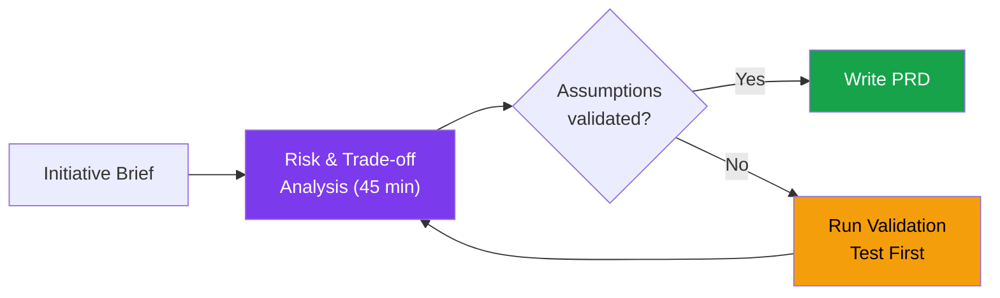
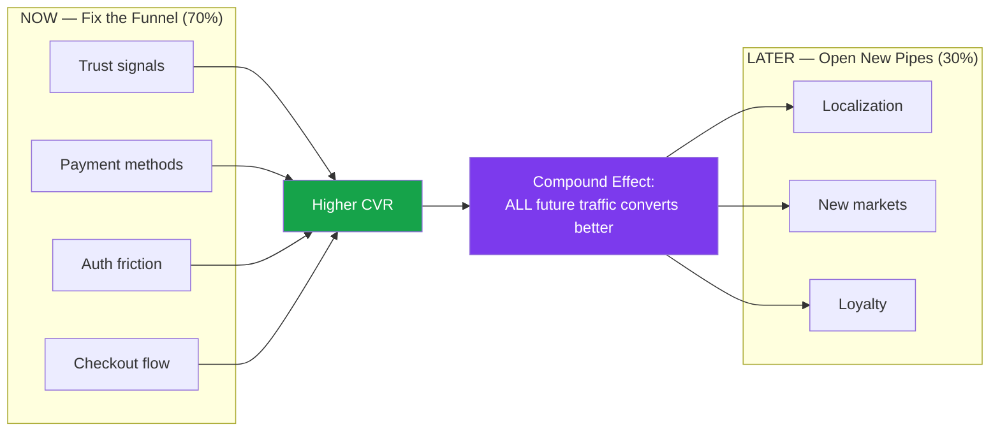
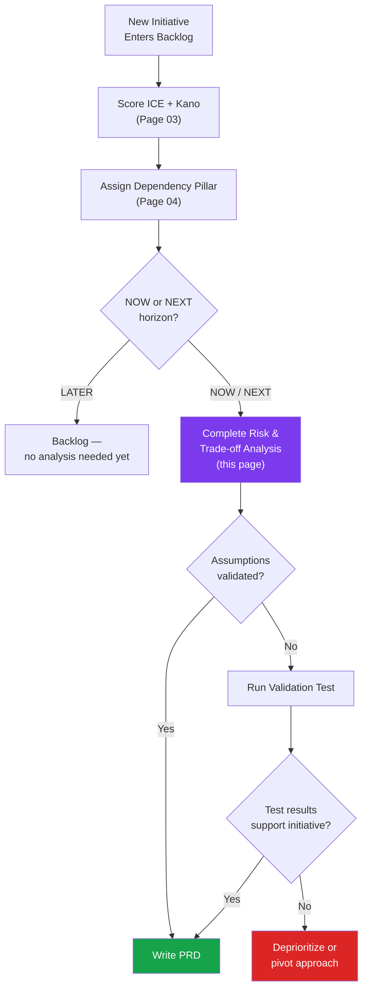

# 06 — Risk & Trade-off Analysis

---

## Why Risk Analysis Before PRD

Every product initiative must complete a Risk & Trade-off Analysis **before** a Product Requirements Document (PRD) is written. This is a **non-negotiable gate** in the SatuSatu product process.

### Purpose

| Reason | What It Prevents |
|---|---|
| **Forces explicit assumptions** | PM commits engineering capacity based on unstated beliefs → surprise failures |
| **Surfaces the failure mode the team is most likely to miss** | Team optimizes for the happy path and discovers the edge case mid-sprint |
| **Aligns RACI before the spec is written** | Miscommunication about who owns what → spec is written, then debated |
| **Creates institutional memory** | Knowledge walks out the door when team members leave |

> **Time commitment**: Each analysis should take **no more than 45 minutes** to complete. If it takes longer, the initiative brief is under-defined — go back to the brief first.

> **Rule**: No PRD without a completed Risk & Trade-off Analysis. No exceptions — even for P0 items. P0 items get a **lightweight** analysis (30 min), not no analysis.

---

## Risk & Trade-off Template

Copy this table for every initiative in the NOW and NEXT horizon.

| Field | Content |
|---|---|
| **Initiative** | [Name from Page 03 scoring table] |
| **ICE Score** | [Score] · [Priority] · [Horizon] |
| **Key Assumptions** | What must be true for this initiative to produce its claimed impact? List 2–3 specific, falsifiable statements. |
| **Biggest Risk** | The single most likely failure mode. Be specific — what goes wrong, for whom, and when? |
| **Second Risk** | The second failure mode. Different category from the first (e.g., if first is user behavior, second is technical). |
| **Validation Approach** | What is the cheapest test that confirms or refutes the key assumption? Specify: metric, duration, sample size threshold. |
| **RACI Table** | See RACI format below. |
| **Trade-offs Accepted** | What are we explicitly NOT doing by investing in this? What is the opportunity cost in engineering days? |

---

## RACI Template

Mandatory for every initiative. Fill in names, not titles.

| Role | R (Responsible) | A (Accountable) | C (Consulted) | I (Informed) |
|---|---|---|---|---|
| Product | | | | |
| Engineering | | | | |
| Design | | | | |
| Ops | | | | |
| Marketing | | | | |
| Finance / Commercial | | | | |
| VC / Leadership | | | | |

**RACI definitions**:
- **R** (Responsible) — Does the work
- **A** (Accountable) — Approves the output, owns the outcome (exactly 1 per initiative)
- **C** (Consulted) — Provides input before decisions are made
- **I** (Informed) — Notified after decisions are made

> **Constraint**: Every initiative must have exactly **one A**. If there are two A's, the ownership is unclear. Resolve before writing the PRD.

---

## Completed Risk Analyses

### 1. Free Cancellation Badge

`ICE: 729` · `P0` · `NOW` · `XS effort` · Kano: Basic

| Field | Content |
|---|---|
| **Key Assumptions** | (1) Foreign visitors actively look for cancellation policies before booking — absence is a dealbreaker, not just a preference. (2) Displaying a badge is sufficient — users trust the badge without needing to read the full policy text. (3) The existing cancellation terms are already competitive; the problem is visibility, not the policy itself. |
| **Biggest Risk** | **Policy-reality mismatch**: Badge implies free cancellation, but actual policy has cutoff windows (e.g., 48h before activity). Users book expecting full flexibility, then discover restrictions → support disputes spike → trust erodes worse than pre-badge. |
| **Second Risk** | **Operator resistance**: Some operators have strict no-cancellation policies. If the badge only appears on some listings, users may interpret unbadged listings as untrustworthy — creating a two-tier marketplace perception. |
| **Validation Approach** | Audit 100% of active listings for cancellation terms (Ops, 1 day). Categorize: free cancel / partial / no cancel. If >80% offer free cancel, badge is viable for majority. For the remainder, display "Cancellation Policy" link instead. No A/B test needed — this is table-stakes parity. Monitor support ticket volume for "cancellation" keyword 30 days post-launch. |
| **Trade-offs Accepted** | XS effort — opportunity cost is negligible (<1 day). The real trade-off is operational: Ops must audit and maintain cancellation policy accuracy. If policies are incorrect, badge creates liability. |

| Role | R | A | C | I |
|---|---|---|---|---|
| Product | Badge UX spec | ✓ Owns outcome | | |
| Engineering | Badge display logic | | | |
| Design | | | Badge visual | |
| Ops | Policy audit | | | |
| Marketing | | | | Badge messaging |

---

### 2. Guest Checkout + SSO

`ICE: 405` · `P1` · `NOW` · `L effort` · Kano: Basic

| Field | Content |
|---|---|
| **Key Assumptions** | (1) Mandatory account creation is the primary abandonment trigger at the "Book Now" step for foreign visitors — not price, not trust, not payment method. (2) Guest users will complete booking without an account. (3) SSO (Google/Apple) is sufficient to capture most foreign visitors — email/password registration is not needed as a primary path. |
| **Biggest Risk** | **Lost retention loop**: Guest bookers cannot receive post-experience review requests or loyalty benefits, reducing review density and repeat bookings. Without accounts, customer support cannot identify users in booking disputes — ops overhead increases. |
| **Second Risk** | **SSO platform dependency**: Google/Apple SSO rate-limits or changes OAuth terms. If SSO is the sole fast-auth method and it goes down, checkout reverts to email/password friction — creating a single point of failure. |
| **Validation Approach** | Before building full guest checkout: add session recording (Hotjar/FullStory/OpenPanel replay) to the account creation gate and measure drop-off %. If >40% of foreign visitors exit at that step, confirm assumption is correct. Build SSO first (lower friction than full guest checkout). Gate guest checkout for 3 months post-SSO to measure SSO's impact isolated. Primary metric: checkout completion rate. |
| **Trade-offs Accepted** | L effort (4–6 weeks) — this delays OTP Auth, My Booking, and Guest Purchase (all depend on SSO). But SSO is the critical path for the Conversion chain (Page 04). Every sprint spent NOT building SSO is a sprint where foreign visitors abandon at registration. |

| Role | R | A | C | I |
|---|---|---|---|---|
| Product | Flow design & spec | ✓ Owns outcome | | |
| Engineering | OAuth implementation | | | |
| Design | | | Auth UX review | |
| Ops | | | | Support flow update |
| Finance | | | | |
| VC / Leadership | | | | |

---

### 3. Platform Social Proof Counter

`ICE: 448` · `P1` · `NOW` · `M effort` · Kano: Basic · PAYCOM

| Field | Content |
|---|---|
| **Key Assumptions** | (1) Foreign visitors use social proof (booking count, review count, total travelers served) as a trust proxy for unfamiliar platforms. (2) SatuSatu has sufficient booking volume to make the counter credible — a counter showing "12 bookings this week" may backfire vs. Klook's "50,000+". (3) The counter is visible and noticed in the user flow — placement matters. |
| **Biggest Risk** | **Credibility backfire**: If booking volume is too low, displaying the number actively harms trust. A counter showing "47 total bookings" next to Klook's "2M+ happy travelers" reinforces SatuSatu's smallness rather than building confidence. |
| **Second Risk** | **Metric gaming**: If the counter includes test bookings, cancelled bookings, or domestic-only bookings, the number is inflated and misleading. Once discovered (e.g., by a blog reviewer), trust damage is disproportionate to the feature's benefit. |
| **Validation Approach** | Before building: calculate current booking volume. If total confirmed bookings < 500, use a softer proof format ("Travelers love this experience" with review snippets) instead of a hard number. If > 500, display as a rounded number ("500+ travelers"). A/B test placement: header vs. listing card vs. checkout page. Primary metric: checkout initiation rate. Duration: 4 weeks or 300 foreign sessions per variant. |
| **Trade-offs Accepted** | M effort (2–3 weeks). This competes with Pre-activity Emails for sprint capacity. Prioritize Social Proof if booking volume ≥ 500; defer if volume is too low for credibility. |

| Role | R | A | C | I |
|---|---|---|---|---|
| Product | Counter UX spec | ✓ Owns outcome | | |
| Engineering | Data pipeline | | Booking volume query | |
| Design | | | Counter visual | |
| Ops | | | Data accuracy | |

---

### 4. Locally Curated Badge Enhancement

`ICE: 392` · `P1` · `NOW` · `S effort` · Kano: Performance

| Field | Content |
|---|---|
| **Key Assumptions** | (1) The existing "Locally Curated" badge is noticed by users but doesn't communicate enough value — enhancing it with visual distinction and tooltip will increase its trust impact. (2) "Locally curated" is a differentiator foreign visitors care about vs. global aggregators. (3) The curation criteria are defensible — not all listings qualify. |
| **Biggest Risk** | **Differentiation dilution**: If too many listings carry the badge, it stops being a differentiator and becomes wallpaper. Unlike Klook's volume play, SatuSatu's local curation is the core brand — diluting it undermines positioning. |
| **Second Risk** | **Localization ambiguity**: "Locally curated" may not translate well for non-English-speaking visitors. Korean or Indian travelers may not understand what "curated" means in context. |
| **Validation Approach** | Calculate current badge penetration — what % of listings carry "Locally Curated"? If >80%, the badge isn't selective enough. Target 40–60% to maintain exclusivity. Enhance with a tooltip: "Hand-selected by our Bali team." Monitor listing page dwell time and checkout initiation rate pre/post enhancement. S effort — deploy and measure in 2 weeks. |
| **Trade-offs Accepted** | S effort (<1 week). Minimal opportunity cost. The risk is purely in the design execution — a poorly designed enhancement makes the badge feel spammy instead of premium. |

| Role | R | A | C | I |
|---|---|---|---|---|
| Product | Enhancement spec | ✓ Owns outcome | | |
| Engineering | | | Badge data model | |
| Design | Visual enhancement | | | |
| Ops | Curation criteria | | | |

---

### 5. Pre-activity Automated Emails

`ICE: 392` · `P1` · `NOW` · `M effort` · Kano: Performance

| Field | Content |
|---|---|
| **Key Assumptions** | (1) Foreign visitors want pre-trip information (meeting point, what to bring, timing) and prefer email delivery over checking the booking page. (2) Email open rates for booking-related emails will be high (>50%) because the content is transactional, not marketing. (3) Pre-activity emails reduce day-of-activity support tickets (meeting point confusion, timing questions). |
| **Biggest Risk** | **Email deliverability**: Foreign visitor email providers (Gmail, Yahoo, Outlook) may route transactional emails to spam/promotions if SatuSatu's sender reputation is not established. Poor deliverability = feature exists but users never see it. |
| **Second Risk** | **Content dependency**: Pre-activity emails require structured activity data (meeting point, duration, what to bring) that may not exist in the current catalog for all listings. If data is incomplete, emails go out with missing fields — worse than no email. |
| **Validation Approach** | Audit catalog: what % of active listings have complete pre-activity data (meeting point, duration, packing list)? If <60%, fix data first before building email automation. Set up sender domain authentication (SPF, DKIM, DMARC) 2 weeks before launch — deliverability requires warm-up. Post-launch: monitor email open rate (target >50%), support ticket volume for "meeting point" / "what to bring" queries. Duration: 4 weeks post-launch. |
| **Trade-offs Accepted** | M effort (2–3 weeks). Soft dependency on confirmed booking flow (Page 04). Cannot trigger email without a booking event. Opportunity cost: delays OTP Auth or Social Proof Counter by 1 sprint if built in parallel. |

| Role | R | A | C | I |
|---|---|---|---|---|
| Product | Email content spec | ✓ Owns outcome | | |
| Engineering | Email automation | | Sender setup | |
| Design | | | Email template | |
| Ops | Activity data audit | | | |
| Marketing | | | | Sender reputation |

---

## The Central Trade-off: Conversion vs. Expansion

> Every rupiah and every sprint hour spent on localization (Later) is a sprint not spent closing the trust and conversion gaps (Now) that make any new traffic — localized or not — convert.
>
> A Korean-speaking user landing on a page with missing trust signals and no cancellation policy will bounce at the same rate as an English-speaking user.
>
> **Fix the funnel leaks before opening new pipes.**

### The Math

For a **~10 engineer team**, the opportunity cost is disproportionately high:

| Scenario | Sprint Investment | Expected Impact |
|---|---|---|
| Fix checkout conversion (Exploit) | 2 sprints | +15–25% foreign checkout CVR → compound effect on ALL future foreign sessions |
| Build Korean localization (Explore) | 4–5 sprints | Korean users arrive → hit same broken checkout → same low CVR → 4 sprints wasted |
| **Correct sequence** | Fix checkout THEN build localization | Korean users arrive → hit functional checkout → convert → localization ROI realized |

---

## How to Embed Risk Analysis into the PM Workflow

| Step | When | Who | Output |
|---|---|---|---|
| 1. Score ICE + Kano | When initiative enters backlog | PM | Priority assignment (P0–P3) |
| 2. Assign Dependency Pillar | Same session | PM | Pillar + Blocked By in tracker |
| 3. Risk & Trade-off Analysis | Before sprint commitment (NOW/NEXT only) | PM + PIC (Person In Charge) | Completed analysis table |
| 4. RACI assignment | During analysis | PM | Named owners per role |
| 5. Write PRD | After analysis approved | PM | Full spec |

> **Read next**: [Page 07 — AI-Assisted Development](./07-ai-assisted-development.md) for how AI tools can accelerate risk analysis writing and PRD drafting.
