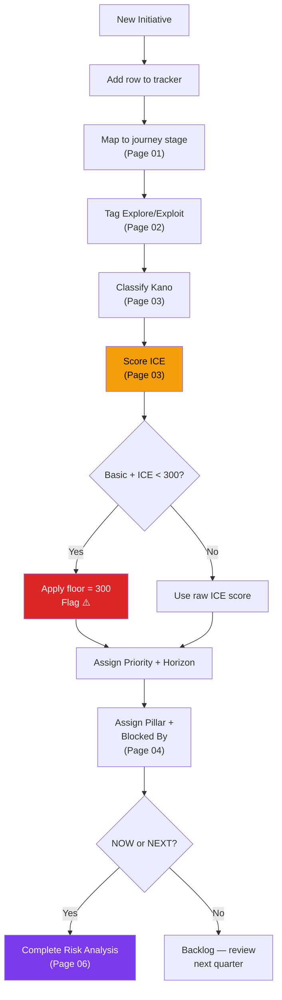

# 08 — Backlog Tracker Guide

---

## Overview

The Backlog Tracker is a **Google Sheet** that serves as the single source of truth for all initiatives. It consolidates ICE scoring, Kano classification, dependency tracking, and sprint status into one filterable view.

> **Format**: Google Sheets (not CSV). Shared with the PM team via Google Drive. One tab per view.

---

## Column Definitions

### Core Columns

| Column | Type | Valid Values | Description |
|---|---|---|---|
| **#** | Number | Auto-increment | Row ID for cross-referencing (matches Page 03 scoring table) |
| **Initiative** | Text | Canonical name | Exact name as used across all playbook pages. Source of truth for naming. |
| **Source** | Dropdown | `Roadmap` / `Pipeline` / `Both` | Which source document(s) the initiative originated from |
| **Squad** | Dropdown | `PAYCOM` / `CONTEX` / `—` | Owning squad. `—` for unassigned items. |

### Scoring Columns

| Column | Type | Valid Values | Description |
|---|---|---|---|
| **Impact (I)** | Number | 1–10 | How much does this move the NSM? (See Page 03 calibration) |
| **Confidence (C)** | Number | 1–10 | How certain are we? (See Page 03 calibration) |
| **Ease (E)** | Number | 1–10 | How easy to implement? (See Page 03 effort-to-ease table) |
| **ICE Score** | Formula | Auto-calculated | `= I × C × E` (max 1000) |
| **Priority** | Formula | `P0` / `P1` / `P2` / `P3` | Auto-assigned from ICE Score range |
| **Kano** | Dropdown | `Basic` / `Performance` / `Delight` / `—` | Kano classification (Page 03) |
| **Explore/Exploit** | Dropdown | `Explore` / `Exploit` | Strategic classification (Page 02) |

### Dependency Columns (from Page 04)

| Column | Type | Valid Values | Description |
|---|---|---|---|
| **Pillar** | Dropdown | `Trust` / `Conversion` / `Discovery` / `—` | Dependency chain assignment |
| **Blocked By** | Text | Initiative name or `—` | Which initiative must ship first |
| **Blocks** | Text | Initiative name(s) or `—` | What this initiative unblocks when shipped |

### Status Columns

| Column | Type | Valid Values | Description |
|---|---|---|---|
| **Horizon** | Dropdown | `NOW` / `NEXT` / `LATER` | Timeline bucket |
| **Effort Size** | Dropdown | `XS` / `S` / `M` / `L` / `XL` | T-shirt sizing |
| **Status** | Dropdown | `—` / `Product Req` / `Design` / `On Dev` / `Testing` / `Next Pickup` / `To Prioritize` / `Released` | Current workflow state |
| **Risk Analysis** | Dropdown | `Done` / `Needed` / `N/A` | Whether Page 06 analysis is complete |

### Metadata Columns

| Column | Type | Description |
|---|---|---|
| **PM** | Text | Assigned PM name |
| **Designer** | Text | Assigned designer name |
| **PRD Link** | URL | Link to PRD document |
| **Jira Link** | URL | Link to Jira epic/story |
| **Latest Update** | Date | Last status change date |
| **Notes** | Text | Free-form notes |

---

## Google Sheets Formulas

### ICE Score (auto-calculated)

In the **ICE Score** column (e.g., column H), enter:

```
=IF(AND(E2<>"", F2<>"", G2<>""), E2*F2*G2, "")
```

Where `E2` = Impact, `F2` = Confidence, `G2` = Ease.

### Priority Assignment (auto-calculated)

In the **Priority** column (e.g., column I):

```
=IF(H2="", "",
  IF(H2>=700, "P0",
    IF(H2>=350, "P1",
      IF(H2>=150, "P2", "P3"))))
```

### Kano Floor Override

Add a **Priority (Adjusted)** column that applies the Kano Basic floor rule:

```
=IF(AND(J2="Basic", I2<>"P0", I2<>"P1"), "P1 ⚠️", I2)
```

This flags any Basic item that scored below P1 — it should be manually reviewed and promoted.

---

## Conditional Formatting Rules

Apply these rules in Google Sheets via **Format → Conditional formatting**:

### Priority Column

| Priority | Background Color | Text Color | Hex |
|---|---|---|---|
| **P0** | Red | White | `#DC2626` / `#FFFFFF` |
| **P1** | Orange | Black | `#F59E0B` / `#000000` |
| **P2** | Amber | Black | `#FCD34D` / `#000000` |
| **P3** | Green | White | `#16A34A` / `#FFFFFF` |

### Horizon Column

| Horizon | Background | Text | Hex |
|---|---|---|---|
| **NOW** | Green | White | `#16A34A` / `#FFFFFF` |
| **NEXT** | Blue | White | `#2563EB` / `#FFFFFF` |
| **LATER** | Purple | White | `#7C3AED` / `#FFFFFF` |

### Blocked By Column

| Condition | Rule | Format |
|---|---|---|
| Blocked | Cell is not `—` and not empty | Light red background (`#FEE2E2`) |
| Unblocked | Cell is `—` | No formatting |

### Status Column

| Status | Background | Hex |
|---|---|---|
| **Released** | Light green | `#D1FAE5` |
| **On Dev** / **Testing** | Light blue | `#DBEAFE` |
| **Product Req** / **Design** | Light yellow | `#FEF3C7` |
| **To Prioritize** | Light purple | `#EDE9FE` |

---

## How to Score New Initiatives

When a new initiative is proposed, follow this process (cross-references Pages 02–04, 06):



### Step-by-Step

1. **Add a new row** in the tracker with the initiative name
2. **Map to journey stage** — Which stage of the customer journey (Page 01) does this address?
3. **Tag Explore/Exploit** — Is this a proven pattern (Exploit) or an uncertain bet (Explore)?
4. **Classify Kano** — Basic (all competitors have it), Performance (more is better), or Delight (unexpected)?
5. **Score ICE** — Use the calibration tables in Page 03. If Kano = Basic, apply ICE floor of 300.
6. **Assign Priority** (P0–P3) and **Horizon** (NOW/NEXT/LATER) from the auto-calculated score
7. **Assign Dependency Pillar** and check **Blocked By** (Page 04)
8. **If NOW/NEXT** → Complete the Risk & Trade-off Analysis (Page 06) before sprint commitment

---

## How to Re-score (Quarterly)

Every quarter, the backlog should be reviewed and re-scored:

| Step | Action | Who |
|---|---|---|
| 1 | Mark all **Released** items as completed | PM |
| 2 | Remove or archive **invalidated** items | PM |
| 3 | Re-score **Confidence** based on new data (competitor launches, user feedback, shipped dependencies) | PM + Engineering PIC |
| 4 | Re-score **Ease** based on current team capacity and technical debt changes | Engineering PIC |
| 5 | Review **Kano** classifications — has any Performance item become Basic? (i.e., competitor shipped it) | PM |
| 6 | Re-calculate ICE scores and re-sort | Auto (formula) |
| 7 | Update Horizon assignments based on new priorities | PM |
| 8 | Regenerate dependency graph (Page 04) | PM |

> **Trigger**: Re-score whenever a major event occurs — not just quarterly. Events include: competitor launches a competing feature, significant user feedback spike, team capacity change, or a dependency ships.

---

## Jira Integration

### Import from Google Sheets to Jira

Jira supports CSV import. To sync the tracker:

1. **Export** the Google Sheet as CSV: **File → Download → Comma-separated values (.csv)**
2. **In Jira**, go to **Project Settings → External System Import → CSV**
3. **Map columns**:

| Tracker Column | Jira Field | Field Type |
|---|---|---|
| Initiative | Summary | Text |
| Priority | Priority | Priority (map P0→Highest, P1→High, P2→Medium, P3→Low) |
| Squad | Component | Component |
| Effort Size | Story Points | (map XS=1, S=2, M=5, L=8, XL=13) |
| Status | Status | Status (map to Jira workflow) |
| Horizon | Label | Label |
| Explore/Exploit | Label | Label |
| Kano | Custom Field | Dropdown |
| Pillar | Custom Field | Dropdown |
| Blocked By | Issue Link | "is blocked by" |
| PRD Link | External Link | URL |

4. **One-way sync**: The Google Sheet remains the source of truth for scoring. Jira is the execution tool. Update scores in the Sheet, not in Jira.

> **Read next**: [Page 09 — Additional Topics](./09-additional-topics.md) for future playbook expansion areas.
