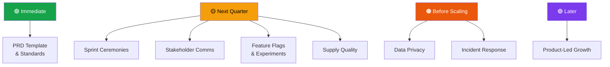

# 09 — Additional Suggested Topics

---

## Overview

The following topics are **not yet covered** in the playbook but would add significant value as the team and product mature. Each is scoped as a standalone page that could be added in future phases.

---

## Topic Briefs

### 1. PRD Template & Standards

| Aspect | Detail |
|---|---|
| **What it covers** | Standardized PRD template with sections (Problem, User Stories, Acceptance Criteria, Metrics, Risks, Dependencies), AI review rubric integration (Page 07, Skill #1), and examples of good vs. bad PRDs |
| **Why it matters** | PRDs are currently ad-hoc. A standard template ensures every initiative is spec'd to the same depth, making engineering estimation and design review more efficient |
| **Suggested owner** | PM Lead |
| **Priority** | 🟢 Immediate — Should be the next page added after this playbook is adopted |

---

### 2. Sprint Ceremony Playbook

| Aspect | Detail |
|---|---|
| **What it covers** | How to run sprint planning, daily standup, sprint review, and retrospective with AI assistance. Includes time-boxing rules, agenda templates, and how to use AI for retro summarization (Page 07, Future Expansions) |
| **Why it matters** | For a ~10-person engineering team, ceremony overhead must be minimal. A playbook ensures ceremonies stay focused and produce actionable outputs |
| **Suggested owner** | PM Lead + Engineering PIC |
| **Priority** | 🟡 Next quarter — Wait until sprint rhythm is stable (3+ consistent sprints) |

---

### 3. Stakeholder Communication Kit

| Aspect | Detail |
|---|---|
| **What it covers** | Board/VC update templates, quarterly business review (QBR) format, how to present metrics (Page 05), roadmap updates (Page 02), and risk summaries (Page 06) to non-product stakeholders |
| **Why it matters** | SatuSatu is VC-backed (TipTip). Regular, structured investor communication builds confidence and reduces ad-hoc reporting requests |
| **Suggested owner** | PM Lead |
| **Priority** | 🟡 Next quarter — Build after 1 quarter of metrics instrumentation (need real data for the first report) |

---

### 4. Feature Flag & Experimentation Protocol

| Aspect | Detail |
|---|---|
| **What it covers** | A/B testing protocol (hypothesis → test → analyze → decide), feature flag management (rollout %, kill switch), statistical significance requirements, and how to connect experiments to NSM (Page 05) |
| **Why it matters** | The conversion funnel estimates in Page 05 are inferred. Real A/B testing is the only way to validate whether shipped features actually move the NSM. Without a protocol, tests are run inconsistently and results are misinterpreted |
| **Suggested owner** | PM + Data/Analytics |
| **Priority** | 🟡 Next quarter — Requires OpenPanel instrumentation to be live first |

---

### 5. Data Privacy & Compliance

| Aspect | Detail |
|---|---|
| **What it covers** | GDPR obligations for EU visitors, data handling for foreign visitor PII (passport info, payment data), cookie consent requirements, data retention policies, and how privacy affects product decisions (e.g., guest checkout data handling) |
| **Why it matters** | SatuSatu targets foreign visitors from EU, Korea, India — GDPR and data sovereignty requirements apply. Non-compliance risk increases as foreign traffic grows |
| **Suggested owner** | Engineering PIC + Legal (external if needed) |
| **Priority** | 🟠 Before scaling foreign traffic — Must be in place before paid acquisition to EU markets scales |

---

### 6. Supply-Side Quality Playbook

| Aspect | Detail |
|---|---|
| **What it covers** | Operator onboarding criteria, listing quality standards (photo requirements, description completeness, pricing accuracy), quality audit cadence, operator rating system, and "Locally Curated" badge criteria (see Page 06, Analysis #4) |
| **Why it matters** | The demand-side playbook (Pages 01–08) optimizes how visitors find and book. But if the supply (listings) is low quality — bad photos, inaccurate descriptions, unreliable operators — conversion improvements are temporary. Supply quality is the long-run foundation |
| **Suggested owner** | Ops Lead |
| **Priority** | 🟡 Next quarter — Begin with a listing quality audit; formalize standards after |

---

### 7. Incident Response for Product

| Aspect | Detail |
|---|---|
| **What it covers** | How product responds to production incidents: severity classification, escalation paths, communication templates (internal + external), post-incident review process, and how incidents feed back into the backlog (Page 08) |
| **Why it matters** | When checkout breaks at 2 AM during peak booking hour, the team needs a playbook — not a Google Chat panic thread. Structured incident response reduces mean time to resolution and prevents recurring issues |
| **Suggested owner** | Engineering PIC |
| **Priority** | 🟠 Before scaling — Build after core checkout flow is stable but before major traffic growth |

---

### 8. Product-Led Growth Mechanics

| Aspect | Detail |
|---|---|
| **What it covers** | Referral program design (see Page 03, #43), viral loop mechanics, review incentivization, post-booking sharing prompts, and network effect analysis for a marketplace |
| **Why it matters** | Currently, all acquisition is paid (Google Ads, Meta). Product-led growth reduces CAC over time and builds a moat. But this is Explore territory (Page 02) — only pursue after Exploit base is stable |
| **Suggested owner** | PM Lead + Marketing |
| **Priority** | 🟣 Later — Post-Exploit phase, after baseline conversion rate is validated (Page 05 target: 2.5–4.5% end-to-end) |

---

## Suggested Sequencing

> **Rule of thumb**: Build the topic playbook when the team is **about to need it**, not after the problem surfaces. If you're 1 sprint away from needing A/B testing, write the Experimentation Protocol now.

---

_SatuSatu Product Management Playbook · AI-Assisted PM Operating System · March 2026_
