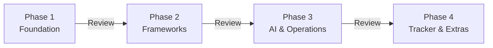

# SatuSatu — AI-Assisted Product Management Playbook

## Implementation Plan (Phased Execution)

> **Output Directory**: `/output-playbook-gemini/`
> **Format**: Markdown files + Mermaid diagrams + CSV template
> **References**: [ProductSchool PM Workflow](https://productschool.com/blog/product-fundamentals/product-management-workflow), [Atlassian PM + AI](https://www.atlassian.com/agile/product-management/pm-and-ai)

---

## Knowledge Sources (Must Read Before Each Phase)

> [!IMPORTANT]
> Every agent/phase **must read and ingest** the relevant source files listed below before generating any content. These files are the single source of truth. Do not infer or fabricate data that exists in these files — extract it directly.

| # | File | Path | Contents | Used By |
|---|---|---|---|---|
| K1 | **satusatu-ux-journey-map.md** | `satusatu-ux-journey-map.md` | Persona definition, competitor UX benchmarking (Klook/KKday/GYG/Trip.com), 6-stage customer journey (Discover→Research→Compare→Book→Experience→Advocate), emotion arc, UX audit findings, friction callouts | Pages 01, 02, 04, 07 |
| K2 | **satusatu-product-roadmap.md** | `satusatu-product-roadmap.md` | Strategic framing (Explore/Exploit), ICE+Kano framework benchmarking, prioritization methodology, dependency chains (Trust/Conversion/Discovery), roadmap initiatives with classifications, risk & trade-off templates, VC intervention protocol | Pages 02, 03, 04, 06 |
| K3 | **satusatu-metrics-framework.md** | `satusatu-metrics-framework.md` | North Star Metric definition, 18 leading indicators, 9 lagging indicators, counter-metrics, PM review ritual cadence, metrics causal relationships, conversion funnel baselines, tracking implementation specs (tools, events, owners) | Pages 05, 07 |
| K4 | **Product Pipeline CSV** | `Satusatu App - Product Planning - Product Pipeline.csv` | Current product backlog: 35+ items across PAYCOM and CONTEX squads. Columns: Project Name, Epic, Effort Size, Status, Priority, Squad. This is the raw backlog that must be enriched with ICE scores, Kano classifications, and Explore/Exploit tags. | Pages 02, 03, 04, 06, 08 |

### Source File Reading Rules

1. **Read before writing** — Each agent must read ALL source files marked for its phase BEFORE generating any content.
2. **Extract, don't infer** — If a data point exists in a source file (e.g., an initiative name, a metric target, a persona detail), use it verbatim. Do not paraphrase initiative names.
3. **Flag gaps** — If a source file lacks data needed for a section (e.g., ICE score for a CSV item), mark it with `⚠ Inferred` and provide reasoning.
4. **Cross-reference** — When an initiative appears in multiple source files, reconcile any conflicts (CSV status vs. roadmap horizon) and note discrepancies.
5. **Preserve CSV item identity** — Every row in K4 must appear in the final backlog tracker (Page 08). None may be dropped.

---

## Execution Phases

The playbook is built in **4 phases**, each producing a reviewable deliverable set. Each phase must be approved before the next begins.



### Phase 1 — Foundation (Pages 00–02)

**Source files to read**: K1 (UX Journey Map), K2 (Product Roadmap), K4 (Product Pipeline CSV)
**Sequential Thinking MCP**: Use before writing Page 02 to reason through Explore/Exploit classification of each initiative from K2+K4 (complex categorization with trade-offs).

| Page | File | Content Summary |
|---|---|---|
| 00 | `00-introduction.md` | Playbook overview, team roles, conventions, linked TOC, **Standardized Tools & Technology Stack** (see spec below) |
| 01 | `01-customer-journey-map.md` | Persona ← K1, 6-stage journey table ← K1, emotion arc ← K1, UX audit ← K1, friction callouts ← K1 cross-ref K4 |
| 02 | `02-strategic-framing.md` | Explore/Exploit theory ← K2, quadrant with ALL initiatives ← K2+K4, ratio analysis ← K2, startup guidance ← K2 |

**Review Gate**: Confirm persona accuracy, journey map completeness, and explore/exploit classifications before proceeding.

---

### Phase 2 — Frameworks (Pages 03–05)

**Source files to read**: K2 (Product Roadmap), K3 (Metrics Framework), K4 (Product Pipeline CSV)
**Sequential Thinking MCP**: Use before writing Page 03 to reason through ICE scoring of each initiative (multi-dimensional scoring with confidence calibration). Use before Page 04 to reason through dependency chain ordering and identify circular dependencies.

| Page | File | Content Summary |
|---|---|---|
| 03 | `03-prioritization-framework.md` | ICE+Kano framework ← K2, scoring all initiatives ← K2+K4, P0-P3 definitions ← K2 |
| 04 | `04-dependency-graph.md` | Trust/Conversion/Discovery chains ← K2, initiative cross-refs ← K2+K4, squad coding ← K4 |
| 05 | `05-north-star-metrics.md` | NSM + all metrics ← K3, causal map ← K3, funnel baseline ← K3, PM review ritual ← K3 |

**Review Gate**: Validate ICE scores, dependency sequences, and metrics framework completeness.

---

### Phase 3 — AI & Risk (Pages 06–07)

**Source files to read**: K1 (UX Journey Map), K2 (Product Roadmap), K3 (Metrics Framework), K4 (Product Pipeline CSV)
**Sequential Thinking MCP**: Use before writing Page 06 to reason through risk & trade-off analysis for each NOW/NEXT initiative (multi-factor risk assessment with mitigation strategies). Use before Page 07 to reason through the mapping of AI tools/MCPs to lifecycle stages (ensure no gaps or redundancies).

| Page | File | Content Summary |
|---|---|---|
| 06 | `06-risk-analysis.md` | Risk template ← K2, RACI ← K2, completed analyses for top initiatives ← K2+K4 |
| 07 | `07-ai-assisted-development.md` | 6-stage PM workflow (see spec below). Uses K1 for audit examples, K3 for metrics agent, K4 for backlog classification examples |

**Review Gate**: Confirm risk analysis template meets team needs, AI workflow is actionable, and tool recommendations are approved.

---

### Phase 4 — Tracker & Extras (Pages 08–09)

**Source files to read**: K2 (Product Roadmap), K4 (Product Pipeline CSV) + all previously generated pages
**Sequential Thinking MCP**: Use before writing Page 08 to reconcile all initiative data across K2, K4, and Pages 02-06 (cross-source data merge with conflict resolution).

| Page | File | Content Summary |
|---|---|---|
| 08 | `08-backlog-tracker.csv` | ALL items from K4, enriched with ICE/Kano/Horizon from Pages 02-03. Every K4 row must appear. |
| 08 | `08-backlog-tracker-guide.md` | Column definitions, Google Sheets formulas, conditional formatting, Jira import |
| 09 | `09-additional-topics.md` | Future playbook expansion roadmap |

**Review Gate**: Validate CSV imports cleanly into Google Sheets, formulas calculate correctly, all backlog items present.

---

## Page 07 — AI-Assisted Product Development (Detailed Spec)

Structured around the **ProductSchool 6-stage PM workflow**, with AI impact classified using their **Simplify / Augment / Automate** framework, and Atlassian's principles of **AI-first mindset**, **specialized agents on company data**, and **sustainable AI habits**.

### 7.1 AI Impact Model

Three tiers of AI integration (per ProductSchool):

| Tier | What It Means | Rule |
|---|---|---|
| **Simplify** | Remove friction — AI handles prep, synthesis, search | Low risk. Auto-run. |
| **Augment** | Enhance judgment — AI drafts options, PM decides | Medium risk. Human reviews. |
| **Automate** | End-to-end task execution — AI agent completes workflow | High oversight. Clear "definition of done" required. |

### 7.2 AI Workflow by Product Lifecycle Stage

> **Note**: LLM model selections and all tool standards are defined in **Page 00 — Standardized Tools & Technology Stack**. Each stage below references the approved tools from that central registry.

Each stage defines: what AI does, which tools, which agent skill to build, and whether it simplifies/augments/automates.

#### Stage 1 — Ideation & Discovery

> **AI Role**: Analyze user feedback, support tickets, interview transcripts → identify themes and pain points.

| Dimension | Detail |
|---|---|
| **AI Tier** | Simplify + Augment |
| **What AI Does** | Synthesize large volumes of qualitative data into ranked theme lists. Generate fresh hypotheses for testing. |
| **Recommended Tools** | Perplexity Pro (fast research), Gemini Deep Research (deep dives), Productboard (feedback analysis), Dovetail (interview synthesis), Sauce AI (multi-source feedback) |
| **Best Model** | Gemini 2.5 Pro (large context for transcript analysis) |
| **Agent Skill to Build** | **Product Research Agent** — automated competitor + market research with citation scoring |
| **Human Role** | Validate themes against product intuition. Decide which problems are worth solving. |

#### Stage 2 — Market Research & Validation

> **AI Role**: Analyze market trends, competitive landscapes, validate assumptions with data.

| Dimension | Detail |
|---|---|
| **AI Tier** | Augment |
| **What AI Does** | Generate competitive intelligence reports, analyze market sizing data, explore strategic scenarios, identify market gaps |
| **Recommended Tools** | Perplexity Pro, Claude (Sonnet 4), Gemini 2.5 Pro with browsing, Google Trends + AI analysis |
| **Best Model** | Claude Sonnet 4 (nuanced strategic analysis) |
| **Agent Skill to Build** | **Competitor Benchmarking Agent** — Activities Vertical monitoring across Klook, KKday, GYG, Trip.com (like the UX journey map format) |
| **Human Role** | Validate market hypotheses. Make go/no-go decisions on opportunities. Run real user validation. |

#### Stage 3 — Planning & Prioritization (incl. PRD)

> **AI Role**: Draft PRDs, define success metrics, score and classify initiatives, generate roadmap narratives.

| Dimension | Detail |
|---|---|
| **AI Tier** | Augment + Automate (for drafts) |
| **What AI Does** | Draft PRDs from context/constraints/user stories. Review existing PRDs for completeness. Auto-classify initiatives using ICE+Kano. |
| **Recommended Tools** | ChatPRD (PRD drafting), Claude Opus 4 (deep reasoning), Confluence (doc management), Jira Product Discovery + Rovo (prioritization) |
| **Best Model** | Claude Opus 4 (PRD quality), Gemini Flash (batch classification) |
| **Agent Skills to Build** | **PRD Review with Scoring Agent** — rubric-based audit (completeness, clarity, testability, risk coverage) → numeric score + actionable feedback. **Risk & Trade-off Analysis Agent** — auto-generate risk tables (Section 06 template) from initiative briefs. |
| **Human Role** | Final prioritization calls. Stakeholder alignment. Trade-off decisions. PRD sign-off. |

#### Stage 4 — Development & Execution (incl. Prototyping)

> **AI Role**: Rapid prototyping, design review, project tracking automation, QA augmentation.

| Dimension | Detail |
|---|---|
| **AI Tier** | Simplify + Augment |
| **What AI Does** | Create rapid prototypes, simulate user interactions, automated accessibility/usability checks, resource allocation optimization |
| **Recommended Tools** | Figma AI / Figma Make (design generation), UXPilot (design review + heatmaps), v0.dev (UI prototyping), Miro AI (visual collaboration), GitHub Copilot / Cursor / Antigravity (coding), Linear AI (project tracking) |
| **Best Model** | Claude Haiku 4 (vision for screenshot analysis), Claude Sonnet 4 (code review) |
| **Agent Skills to Build** | **UIUX/Figma Review with Scoring Agent** — screenshot input → accessibility, consistency, usability scoring with rubric. **Feature/Website Audit Agent** — periodic automated UX review against journey map criteria (Page 01). |
| **Human Role** | Design taste. Architecture decisions. User testing interpretation. Sprint management. |

#### Stage 5 — Launch & Go-to-Market

> **AI Role**: Coordinate launch communications, draft release notes, monitor initial adoption signals.

| Dimension | Detail |
|---|---|
| **AI Tier** | Simplify + Automate |
| **What AI Does** | Auto-generate release notes from Jira issues (problem-solution format). Draft launch comms. Monitor initial adoption metrics. |
| **Recommended Tools** | Rovo (release notes from Jira), ClickUp Brain (project status), Gemini Flash (fast summaries), OpenPanel + LLM (metrics narrative) |
| **Best Model** | Gemini 2.5 Flash (speed for launch-day monitoring) |
| **Agent Skill** | Reuse existing tools — no custom skill needed at this stage |
| **Human Role** | Go/no-go decision. Stakeholder communication. Market positioning. Crisis management. |

#### Stage 6 — Post-Launch Analysis & Iteration

> **AI Role**: Analyze A/B test data, monitor user sentiment, synthesize feedback, generate iteration hypotheses.

| Dimension | Detail |
|---|---|
| **AI Tier** | Augment + Automate |
| **What AI Does** | Rapidly analyze A/B test results. Synthesize user sentiment from reviews/tickets. Auto-generate weekly metrics pulse summaries. Feed insights back into ideation cycle. |
| **Recommended Tools** | Gemini 2.5 Pro (data analysis), Miro AI (feedback summarization), OpenPanel + LLM pipeline, Sauce AI (multi-source sentiment) |
| **Best Model** | Gemini 2.5 Pro (data + large context), Claude Sonnet 4 (narrative synthesis) |
| **Agent Skill to Build** | **Automated Metrics Narrative Agent** — Gemini reads OpenPanel data → writes weekly PM pulse summary in the format from Page 05's PM review ritual |
| **Human Role** | Interpret results. Decide what to iterate. Kill underperforming experiments. Feed learning back into Stage 1. |

### 7.4 Key Considerations (Non-Negotiable Principles)

Drawing from ProductSchool best practices and Atlassian's AI+PM guidance:

| Principle | What It Means | How to Enforce |
|---|---|---|
| **Human in the Loop** | "First pass by AI, final pass by PM." All AI outputs are drafts. PMs own product judgment, trade-offs, and stakeholder narrative. | Template rule: every AI-generated doc starts with `⚠️ AI DRAFT — PM REVIEW REQUIRED` header |
| **RAG-Style Data** | Ground AI on company-specific data (PRDs, tickets, internal docs, metrics) — not generic internet knowledge. Reduces hallucination risk. (ProductSchool: "Ground generation with retrieval, not vibes.") | Maintain a single source of truth (Confluence/Notion) and point all AI tools to it. If AI output can't cite where it got facts, assume unreliable. |
| **Tool Selection** | Specialized tools for specific tasks, not one AI for everything. Match the model to the cognitive demand. (Atlassian: "The future lies in specialized agents trained on specialized data.") | Use the Stage → Tool matrix above. Never default to "just ask ChatGPT." |
| **Decision-Point Design** | Design workflow around the 6–10 decisions that truly move the product. Use AI to accelerate everything around those decisions. | Map decision points per stage. AI accelerates inputs; human makes the call. |
| **Prompt Hygiene** | Capture prompts and workflows that consistently produce value → turn into team standards (reusable agent skills). | Store in GitHub public repo (see 7.5). Review and improve monthly. |
| **Trust as a Metric** | Track where AI helps and where it hurts: edit distance, rework rate, time-to-decision. When trust drops, narrow scope. | Add "AI Assist Quality" column to sprint retro template. |
| **Cross-Functional AI** | AI must be a cross-functional interface, not a PM toy. Design, eng, and CS use the same AI-enabled conventions. | Shared summaries, shared decision logs, shared retrieval sources. |

### 7.5 Agent Skills the Team Must Build

Six custom agent skills mapped to the lifecycle stages:

| # | Agent Skill | Lifecycle Stage | Input | Output | Priority |
|---|---|---|---|---|---|
| 1 | **PRD Review with Scoring** | Stage 3 | PRD document | Rubric score (0-100) + gap list + improvement suggestions | P1 — Build first |
| 2 | **UIUX/Figma Review with Scoring** | Stage 4 | Screenshot / Figma export | Accessibility, consistency, usability scores + violation list | P1 — Build first |
| 3 | **Product Research** | Stage 1-2 | Research brief / topic | Structured report with citations and confidence scoring | P2 |
| 4 | **Risk & Trade-off Analysis** | Stage 3 | Initiative brief | Risk table (Page 06 template) + RACI draft | P2 |
| 5 | **Feature/Website Audit** | Stage 4, 6 | URL / screenshot set | UX audit report against journey map criteria | P3 |
| 6 | **Competitor Benchmarking** | Stage 2, 6 | Competitor list + criteria | Benchmarking table (like UX journey map format) | P3 |

### 7.6 Recommended MCP Servers for PM & Design

MCP (Model Context Protocol) servers connect AI agents directly to your tools, giving them real-time read/write access instead of relying on copy-paste or screenshots. These are the recommended MCPs for the product team:

**Core MCPs (Must Install)**

| MCP Server | What It Does | Used By | Lifecycle Stages |
|---|---|---|---|
| **Atlassian MCP** | Read/write Confluence pages (PRDs, specs), search Jira issues, create/transition tickets, add comments. Enables RAG on your actual product docs. | PM, Eng | All stages — the primary RAG source for all AI workflows |
| **Figma MCP** (Dev Mode) | Pull real design data (components, styles, layout, tokens) from Figma files into AI agents. Enables accurate design-to-code and design review without screenshots. | Design, PM | Stage 4 (Prototyping & Design Review) |
| **Sequential Thinking MCP** | Structured multi-step reasoning for complex analyses. Breaks down problems into thought chains with revision and branching. Prevents hallucination on complex prioritization/risk tasks. | PM | Stage 3 (Planning), Stage 6 (Analysis) |

**Recommended MCPs (High Value)**

| MCP Server | What It Does | Used By | Lifecycle Stages |
|---|---|---|---|
| **GitHub MCP** | Manage repos, PRs, issues, code search. Essential for the agent skills repo and engineering collaboration. | PM, Eng | Stage 5 (Execution), Skills management |
| **Google Drive MCP** | Access shared docs, spreadsheets (e.g., backlog tracker), presentations. AI can read/update the backlog CSV directly. | PM, All | Stage 1 (Research), Stage 3 (Planning) |
| **NotebookLM MCP** | RAG over uploaded product docs; source-cited Q&A via Claude Code. Enables deep grounded research over PRDs, research reports, and metrics docs. | PM | Stage 1-2 (Research), Stage 3 (Planning) |
| **Brave Search / Web Search MCP** | Privacy-first web search for market research, competitor analysis, and trend monitoring without leaving the AI workflow. | PM | Stage 1-2 (Discovery & Research) |

**Design-Specific MCPs**

| MCP Server | What It Does | Used By |
|---|---|---|
| **Figma MCP** (repeated — core for design) | Component introspection, style token extraction, layout analysis for AI-powered design review agents | Design |
| **Playwright MCP** | Automated browser testing and screenshot capture. Powers the Feature/Website Audit agent skill for visual regression and UX checks. | QA, PM |

**MCP Setup Guidance** (to be detailed in Page 07):
1. Each team member installs MCPs in their AI IDE (Claude Code as primary)
2. Atlassian MCP + Figma MCP are mandatory for all PMs and designers
3. MCP credentials managed via team-shared config (no individual API keys floating around)
4. Monthly MCP audit: review which servers are used, which are stale, what's missing

### 7.7 How to Store & Share Skills (Free Tools)

- **GitHub public repo** — Free, version-controlled, team-shareable
- Repo structure:
  ```
  satusatu-pm-skills/
  ├── README.md
  ├── skills/
  │   ├── prd-review/
  │   │   ├── SKILL.md          # Instructions + rubric
  │   │   ├── prompts/          # Reusable prompts
  │   │   └── examples/         # Sample inputs/outputs
  │   ├── uiux-review/
  │   ├── product-research/
  │   ├── risk-analysis/
  │   ├── feature-audit/
  │   └── competitor-benchmark/
  └── .github/
      └── CONTRIBUTING.md
  ```
- Each skill file follows: **Description → Input → Output → Model → Example Prompt → Rubric**
- Reference repos: `anthropics/skills`, `heilcheng/awesome-agent-skills`, `deanpeters/Product-Manager-Skills`
- Team onboarding: clone repo → configure in Claude Code IDE or paste into Claude Projects

### 7.8 Additional AI-Powered PM Activities

Future expansions mapped to lifecycle stages:

| Activity | Stage | Tier |
|---|---|---|
| AI-assisted sprint retrospective analysis | Stage 6 | Augment |
| Automated changelog generation from Jira | Stage 5 | Automate |
| AI customer feedback synthesis (reviews + tickets → themes) | Stage 1, 6 | Simplify |
| Predictive analytics for feature adoption | Stage 6 | Augment |
| AI-powered A/B test hypothesis generation | Stage 6 | Augment |
| Automated weekly metrics narrative (OpenPanel → PM pulse) | Stage 6 | Automate |
| AI-drafted stakeholder update emails | Stage 5 | Simplify |
| Competitive pricing monitor | Stage 2 | Automate |

---

## Pages 00–06, 08–09 Content Summary

(Unchanged from previous plan. See detailed specs below.)

### Page 00 — Introduction & Table of Contents

`00-introduction.md` — Playbook overview, team roles, document conventions, linked TOC. Sets the "product operating system" metaphor. Includes the AI-first mindset framing from Atlassian.

**Section: Standardized Tools & Technology Stack** (embedded in Page 00)

A team-wide standard defining the approved tools for every product activity. This is the single reference for what tool to use when.

| Category | Tool | Purpose | Owner |
|---|---|---|---|
| **Diagramming** | Mermaid (in Markdown) | All flowcharts, dependency graphs, journey maps, architecture diagrams. Renders in Confluence, GitHub, VS Code, Notion. | PM / All |
| **PRD & Documentation** | Confluence | Single source of truth for PRDs, specs, decision logs, playbook pages. AI tools read from here (RAG). | PM |
| **Design** | Figma | All UI/UX design, prototyping, design system. Design review via agent skills + Figma MCP. | Design |
| **Project Management** | Jira | Sprint tracking, backlog management, issue tracking. AI agents read/write here for status automation. | PM + Eng |
| **Analytics** | OpenPanel | Product analytics, event tracking, funnel measurement. AI reads data for metrics narratives. | PM + Data |
| **Communication** | Google Chat | Team communication, AI bot integrations, async updates. | All |
| **Knowledge Base** | Confluence + GitHub | Confluence for product docs, GitHub for code + agent skills repo (PM only; Engineers use GitLab). Both serve as RAG sources if needed. | All |
| **RAG / Research** | NotebookLM | Upload product docs, PRDs, and research to create grounded AI notebooks. Use alongside Claude Code (via NotebookLM MCP) for deep, source-cited Q&A. | PM |

**LLM Model Standards** (approved models — 1 paid subscription: Claude Code Pro; Gemini on free tier):

| Model | Primary Use Cases | When to Use | Context Window | Subscription |
|---|---|---|---|---|
| **Claude Sonnet 4** | PRD drafting & review, risk analysis, strategic docs, code review | Deep reasoning tasks requiring nuance and accuracy | 200K | Claude Code Pro |
| **Claude Opus 4** | Complex multi-step analysis, architectural decisions | Highest-stakes documents requiring maximum quality | 200K | Claude Code Pro |
| **Claude Haiku 4** | Vision tasks (screenshot/Figma analysis), structured output, fast triage | Image inputs, quick structured responses, batch classification | 200K | Claude Code Pro |
| **Gemini 2.5 Pro** | Large-context analysis, data/spreadsheet work, Google ecosystem integration | When you need to process large docs (>100K tokens) or work with Google tools | 1M | Free tier |
| **Gemini 2.5 Flash** | Backlog tagging, quick summaries, triage, status updates, batch processing | High-volume, low-complexity tasks where speed matters | 1M | Free tier |

**Model Selection Principle**: Multi-model approach. Match cognitive demand to model capability. Standardize on 1 paid subscription (Claude Code Pro). Gemini free tier for supplementary tasks.

**Tool Adoption Rules**:
1. **Preferred tools first** — If a tool is not on this list, it is not advisable for product work but encouraged to be explored/compared and suggested. New tools require CPO approval.
2. **AI outputs are drafts** — Every AI-generated artifact starts with `⚠️ AI DRAFT — PM REVIEW REQUIRED`.
3. **Confluence is the source of truth** — If it's not in Confluence, it doesn't exist. AI tools pull context from Confluence (RAG).
4. **Mermaid for all diagrams** — No Lucidchart, no draw.io, no PowerPoint flowcharts. Mermaid lives in markdown, versions with code.
5. **Figma for all design** — No Sketch, no Adobe XD. One design tool, one design system.

### Page 01 — Customer Journey Map
`01-customer-journey-map.md` — Persona summary, competitor UX scoring table, 6-stage journey table (Phase → Action → Emotion → Touchpoint → Gap/Opportunity), emotion arc (Mermaid XY chart), friction callouts cross-referenced to backlog, UX audit findings.

### Page 02 — Strategic Framing: Explore vs. Exploit
`02-strategic-framing.md` — March (1991) theory, Explore/Exploit quadrant with all CSV + roadmap initiatives, current ratio (64/36) → target (70/30), simplified tracking (tag backlog items + trend), startup-stage ratios.

### Page 03 — Prioritization Framework: ICE + Kano
`03-prioritization-framework.md` — Framework benchmarking (ICE/RICE/Kano/WSJF/MoSCoW/Value-Effort), why ICE+Kano, Kano definitions with examples, ICE dimensions + calibration, scoring session guide (5 steps), worked calculation example, Effort Size (XS-XL), Priority (P0-P3), Feature Classification Labels with ICE Floor Rules, complete scoring table, VC Intervention Protocol.

### Page 04 — Dependency Graph & Sequencing
`04-dependency-graph.md` — Trust/Conversion/Discovery chains as Mermaid flowcharts, squad color coding, status indicators, cross-references.

### Page 05 — North Star & Success Metrics
`05-north-star-metrics.md` — NSM definition + formula, 18 leading indicators, 9 lagging indicators, counter-metrics, PM review ritual, metrics causal map, conversion funnel baseline.

### Page 06 — Risk & Trade-off Analysis
`06-risk-analysis.md` — Pre-PRD gate rationale, risk template, RACI template, completed analyses for NOW/NEXT initiatives, PRD integration, central trade-off.

### Page 08 — Backlog Tracker
`08-backlog-tracker.csv` — All initiatives with: ID, Epic, Initiative, Squad, Feature Label, Pillar, Kano, Impact, Confidence, Ease, ICE Score, Priority, Effort, Status, Horizon, Explore/Exploit, PM, Designer, Update, Impact Type, PRD Link, JIRA Link.
`08-backlog-tracker-guide.md` — Column definitions, Google Sheets formulas, conditional formatting, Jira import guide.

### Page 09 — Additional Suggested Topics
`09-additional-topics.md` — PRD Template & Standards, Sprint Ceremony Playbook, Stakeholder Communication Kit, Feature Flag & Experimentation, Data Privacy & Compliance, Supply-Side Quality Playbook, Incident Response, Product-Led Growth Mechanics.

---

## Multi-Agent Execution Strategy

Where possible, pages are produced in parallel by independent agents. **Sequential Thinking MCP is used as a pre-step** before writing complex pages to ensure reasoning quality.

| Phase | Step 1: Sequential Thinking | Step 2: Parallel Agents | Dependencies |
|---|---|---|---|
| Phase 1 | 🧠 Think through Explore/Exploit classifications for all K2+K4 initiatives | Agent A: Page 00 (intro) · Agent B: Page 01 (journey map) · Agent C: Page 02 (strategic framing, informed by thinking output) | None — all read from source docs independently |
| Phase 2 | 🧠 Think through ICE scoring for all initiatives + dependency chain ordering | Agent D: Page 03 (prioritization, informed by thinking output) · Agent E: Page 04 (dependency graph) · Agent F: Page 05 (metrics) | Page 03 first → Pages 04, 05 reference it |
| Phase 3 | 🧠 Think through risk analysis for top initiatives + AI tool-to-stage mapping | Agent G: Page 06 (risk) · Agent H: Page 07 (AI development) | Page 06 references Page 03. Page 07 is independent. |
| Phase 4 | 🧠 Think through data reconciliation across all sources and generated pages | Agent I: Page 08 (CSV + guide) · Agent J: Page 09 (extras) | Page 08 requires all prior pages |

### When to Use Sequential Thinking MCP

| Trigger | Why | Example |
|---|---|---|
| Multi-dimensional scoring | Prevents flawed reasoning across Impact/Confidence/Ease dimensions | ICE scoring 35+ initiatives in Page 03 |
| Classification with trade-offs | Ensures consistent categorization logic | Explore/Exploit tagging in Page 02 |
| Dependency analysis | Catches circular dependencies and ordering conflicts | Trust/Conversion/Discovery chains in Page 04 |
| Risk assessment | Forces structured consideration of probability, impact, and mitigation | Risk tables for NOW/NEXT initiatives in Page 06 |
| Cross-source data merge | Resolves conflicts between K2 and K4 data | Backlog tracker reconciliation in Page 08 |
| Tool-to-workflow mapping | Prevents gaps and redundancies in recommendations | AI tool mapping in Page 07 |

## Verification Plan

1. **Markdown rendering** — Confirm Mermaid diagrams render in VS Code / GitHub preview
2. **CSV validation** — Import `08-backlog-tracker.csv` into Google Sheets, verify formulas
3. **Cross-reference integrity** — Initiative names and ICE scores consistent across Pages 02-08
4. **Completeness** — All 35+ CSV backlog items + 17 roadmap initiatives present in tracker
5. **Article alignment** — Verify Page 07 maps to all 6 ProductSchool stages and incorporates Atlassian principles
6. **Sequential Thinking audit** — Verify all complex reasoning pages (02, 03, 04, 06, 07, 08) used Sequential Thinking MCP before content generation
